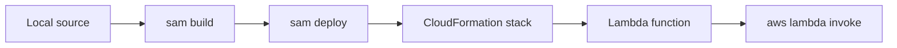

# Deploy Your First Node.js Lambda Function

This tutorial deploys a basic Node.js Lambda function with AWS SAM and shows the equivalent AWS CLI workflow for direct function creation.

## Prerequisites

- A Node.js handler that works locally.
- An IAM execution role ARN in `$ROLE_ARN`.
- AWS CLI and SAM CLI configured for `$REGION`.
- A unique function name in `$FUNCTION_NAME`.

## Package the Function

Use a small handler that returns deployment metadata:

```javascript
export const handler = async () => {
    return {
        statusCode: 200,
        body: JSON.stringify({
            message: "first deploy succeeded",
            region: process.env.AWS_REGION,
        }),
    };
};
```

Example `template.yaml`:

```yaml
AWSTemplateFormatVersion: "2010-09-09"
Transform: AWS::Serverless-2016-10-31
Resources:
  NodeFirstDeployFunction:
    Type: AWS::Serverless::Function
    Properties:
      FunctionName: !Sub "${AWS::StackName}-node-first-deploy"
      Runtime: nodejs20.x
      Handler: src/handler.handler
      CodeUri: .
      MemorySize: 256
      Timeout: 10
```

## Deploy with AWS SAM

Build the function package:

```bash
sam build
```

Run the first guided deployment:

```bash
sam deploy --guided
```

Typical guided answers:

- Stack Name: `nodejs-first-deploy`
- AWS Region: `$REGION`
- Confirm changes before deploy: `Y`
- Allow SAM CLI IAM role creation: `Y`
- Save arguments to configuration file: `Y`

After the first guided run, deploy updates with:

```bash
sam build
sam deploy
```

## Invoke the Deployed Function

Invoke through the Lambda API:

```bash
aws lambda invoke \
    --function-name "$FUNCTION_NAME" \
    --region "$REGION" \
    response.json
```

Read the output file:

```json
{"statusCode":200,"body":"{\"message\":\"first deploy succeeded\",\"region\":\"ap-northeast-2\"}"}
```

Inspect configuration:

```bash
aws lambda get-function \
    --function-name "$FUNCTION_NAME" \
    --region "$REGION"
```

## Equivalent AWS CLI Deployment

If you are not using SAM, create a ZIP archive and upload it directly:

```bash
zip --recurse-paths function.zip src package.json package-lock.json
aws lambda create-function \
    --function-name "$FUNCTION_NAME" \
    --runtime nodejs20.x \
    --handler src/handler.handler \
    --zip-file fileb://function.zip \
    --role "$ROLE_ARN" \
    --region "$REGION"
```

Update code later with:

```bash
aws lambda update-function-code \
    --function-name "$FUNCTION_NAME" \
    --zip-file fileb://function.zip \
    --region "$REGION"
```



## Deployment Notes

- SAM stores deployment metadata in `samconfig.toml` after guided setup.
- CLI-based `create-function` needs an execution role before the first deploy.
- Function updates can take a short time to become active while Lambda finishes code and configuration propagation.

## Verification

Run:

```bash
sam build
sam deploy
aws lambda invoke --function-name "$FUNCTION_NAME" --region "$REGION" response.json
aws lambda get-function-configuration --function-name "$FUNCTION_NAME" --region "$REGION"
```

Confirm that:

- The stack deploys without CloudFormation failures.
- Invocation returns HTTP 200 in `response.json`.
- Configuration shows the expected runtime and handler.

## See Also

- [Run a Node.js Lambda Function Locally](./01-local-run.md)
- [Configure a Node.js Lambda Function](./03-configuration.md)
- [Infrastructure as Code](./05-infrastructure-as-code.md)
- [Language Guide Overview](./index.md)

## Sources

- [Deploying serverless applications with AWS SAM](https://docs.aws.amazon.com/serverless-application-model/latest/developerguide/deploying-sam-apps.html)
- [sam deploy](https://docs.aws.amazon.com/serverless-application-model/latest/developerguide/sam-cli-command-reference-sam-deploy.html)
- [CreateFunction](https://docs.aws.amazon.com/lambda/latest/api/API_CreateFunction.html)
- [Invoking Lambda functions with the AWS CLI](https://docs.aws.amazon.com/lambda/latest/dg/example_lambda_Invoke_section.html)
