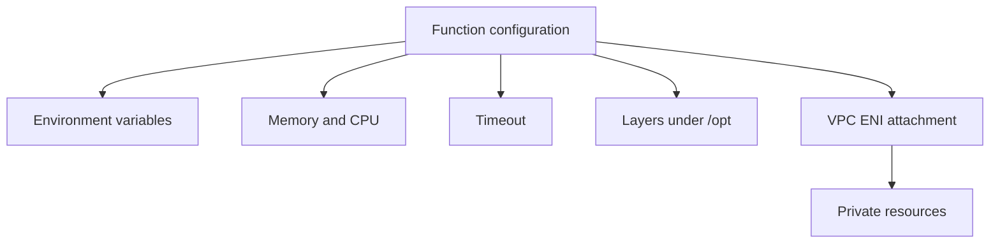

# Configure a Node.js Lambda Function

This tutorial covers the configuration controls you will tune most often for Node.js Lambda functions: environment variables, memory, timeout, layers, and VPC networking.

## Key Settings at a Glance

| Setting | Why it matters |
|---|---|
| Environment variables | Separate code from deploy-time settings. |
| Memory size | Changes both memory and proportional CPU allocation. |
| Timeout | Limits maximum execution duration per invocation. |
| Layers | Share dependencies and common assets across functions. |
| VPC config | Required for private subnet access to VPC resources. |

## Example Handler

```javascript
export const handler = async () => {
    return {
        statusCode: 200,
        body: JSON.stringify({
            stage: process.env.APP_STAGE,
            tableName: process.env.TABLE_NAME,
            hasLayerConfig: Boolean(process.env.SHARED_CONFIG_PATH),
        }),
    };
};
```

## Configure with SAM

```yaml
Resources:
  NodeConfigFunction:
    Type: AWS::Serverless::Function
    Properties:
      Runtime: nodejs20.x
      Handler: src/handler.handler
      CodeUri: .
      MemorySize: 512
      Timeout: 15
      Layers:
        - !Ref SharedNodeLayer
      VpcConfig:
        SecurityGroupIds:
          - sg-xxxxxxxx
        SubnetIds:
          - subnet-xxxxxxxx
          - subnet-yyyyyyyy
      Environment:
        Variables:
          APP_STAGE: prod
          TABLE_NAME: app-orders
          SHARED_CONFIG_PATH: /opt/config/app.json
  SharedNodeLayer:
    Type: AWS::Serverless::LayerVersion
    Properties:
      LayerName: shared-node-deps
      ContentUri: layer
      CompatibleRuntimes:
        - nodejs20.x
```

## Configure with AWS CLI

Update environment variables:

```bash
aws lambda update-function-configuration \
    --function-name "$FUNCTION_NAME" \
    --environment "Variables={APP_STAGE=prod,TABLE_NAME=app-orders,SHARED_CONFIG_PATH=/opt/config/app.json}" \
    --region "$REGION"
```

Update memory and timeout:

```bash
aws lambda update-function-configuration \
    --function-name "$FUNCTION_NAME" \
    --memory-size 512 \
    --timeout 15 \
    --region "$REGION"
```

Attach a layer:

```bash
aws lambda update-function-configuration \
    --function-name "$FUNCTION_NAME" \
    --layers "$LAYER_ARN" \
    --region "$REGION"
```

Configure VPC networking:

```bash
aws lambda update-function-configuration \
    --function-name "$FUNCTION_NAME" \
    --vpc-config "SubnetIds=$SUBNET_ID,SecurityGroupIds=sg-xxxxxxxx" \
    --region "$REGION"
```

## Node.js-Specific Considerations

- Keep initialization code outside the handler to reuse connections across invocations.
- Use environment variables for feature flags and endpoint selection.
- Right-size memory after measuring duration, cold start, and cost trade-offs.
- Only place a function in a VPC when it must reach private resources such as RDS or internal services.



## Reading Layer Content in Node.js

Files added by a layer are available under `/opt`:

```javascript
import { readFile } from "node:fs/promises";

export const handler = async () => {
    const config = await readFile("/opt/config/app.json", "utf8");
    return {
        statusCode: 200,
        body: config,
    };
};
```

## Verification

Check current configuration:

```bash
aws lambda get-function-configuration \
    --function-name "$FUNCTION_NAME" \
    --region "$REGION"
```

Verify the function still runs after each change:

```bash
aws lambda invoke \
    --function-name "$FUNCTION_NAME" \
    --region "$REGION" \
    response.json
```

Confirm that:

- Environment variables appear in the configuration output.
- Memory, timeout, layer ARNs, and VPC settings match the intended values.
- Invocation succeeds after the update finishes.

## See Also

- [Deploy Your First Node.js Lambda Function](./02-first-deploy.md)
- [Node.js Runtime Reference](./nodejs-runtime.md)
- [Layers Recipe](./recipes/layers.md)
- [RDS Proxy Recipe](./recipes/rds-proxy.md)

## Sources

- [Configuring Lambda function options](https://docs.aws.amazon.com/lambda/latest/dg/configuration-function-common.html)
- [Using Lambda environment variables](https://docs.aws.amazon.com/lambda/latest/dg/configuration-envvars.html)
- [Configuring Lambda memory](https://docs.aws.amazon.com/lambda/latest/dg/configuration-memory.html)
- [Configuring Lambda timeout](https://docs.aws.amazon.com/lambda/latest/dg/configuration-timeout.html)
- [Configuring Lambda functions to access resources in a VPC](https://docs.aws.amazon.com/lambda/latest/dg/configuration-vpc.html)
