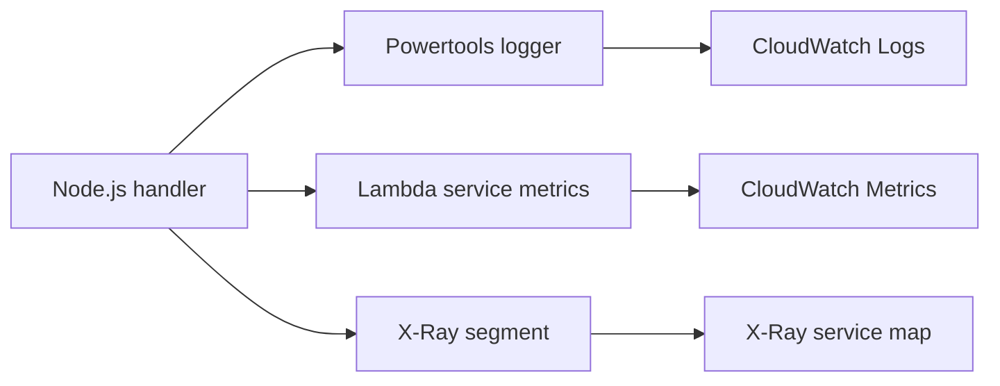

# Logging and Monitoring for Node.js Lambda Functions

This tutorial adds structured logging, CloudWatch visibility, and tracing for a Node.js Lambda function.
The examples use AWS Lambda Powertools for TypeScript logger utilities and AWS X-Ray-compatible tracing settings.

## Monitoring Goals

- Emit structured JSON logs that are easy to filter in CloudWatch Logs.
- Correlate logs with request IDs and trace IDs.
- Capture latency and error signals with native Lambda metrics and traces.

## Install Logging Dependencies

```bash
npm install @aws-lambda-powertools/logger
```

## Example Handler with Structured Logging

```javascript
import { Logger } from "@aws-lambda-powertools/logger";

const logger = new Logger({ serviceName: "orders-api" });

export const handler = async (event, context) => {
    logger.addContext(context);
    logger.appendKeys({ route: event?.rawPath ?? "unknown" });
    logger.info("processing request", {
        requestId: context.awsRequestId,
        method: event?.requestContext?.http?.method,
    });

    try {
        const response = {
            statusCode: 200,
            body: JSON.stringify({ message: "ok" }),
        };
        logger.info("request completed", { statusCode: response.statusCode });
        return response;
    } catch (error) {
        logger.error("request failed", error);
        throw error;
    }
};
```

## Enable Tracing in SAM

```yaml
Resources:
  NodeObservedFunction:
    Type: AWS::Serverless::Function
    Properties:
      Runtime: nodejs20.x
      Handler: src/handler.handler
      CodeUri: .
      Tracing: Active
      Environment:
        Variables:
          POWERTOOLS_SERVICE_NAME: orders-api
          LOG_LEVEL: INFO
```

## CloudWatch Logs Workflow

After invocation, view recent logs:

```bash
aws logs tail "/aws/lambda/$FUNCTION_NAME" --follow --region "$REGION"
```

Inspect Lambda metrics in CloudWatch:

- `Invocations`
- `Errors`
- `Duration`
- `Throttles`
- `ConcurrentExecutions`

## X-Ray Tracing Workflow

Enable active tracing, then invoke the function normally.
Lambda emits segments for the service and downstream integrations that support X-Ray instrumentation.

```bash
aws lambda update-function-configuration \
    --function-name "$FUNCTION_NAME" \
    --tracing-config Mode=Active \
    --region "$REGION"
```

## CloudWatch Logs Insights Query

Use structured JSON logs to search failures quickly:

```sql
fields @timestamp, @message, level, route, requestId
| filter level = "ERROR"
| sort @timestamp desc
| limit 20
```



## Operational Tips

!!! note
    Prefer JSON logs over plain strings so CloudWatch Logs Insights can parse fields consistently across functions.

!!! note
    Avoid logging secrets, access tokens, or full request payloads unless you have a clear redaction policy.

## Verification

Run an invocation and check all three signal types:

```bash
aws lambda invoke --function-name "$FUNCTION_NAME" --region "$REGION" response.json
aws logs tail "/aws/lambda/$FUNCTION_NAME" --region "$REGION"
aws lambda get-function-configuration --function-name "$FUNCTION_NAME" --region "$REGION"
```

Success means:

- Invocation creates JSON log entries in CloudWatch Logs.
- Function configuration shows `TracingConfig` set to `Active`.
- CloudWatch metrics update after execution.

## See Also

- [Configure a Node.js Lambda Function](./03-configuration.md)
- [Custom Metrics Recipe](./recipes/custom-metrics.md)
- [EventBridge Rule Recipe](./recipes/eventbridge-rule.md)
- [Platform Overview](../../platform/index.md)

## Sources

- [Monitor Lambda functions using CloudWatch](https://docs.aws.amazon.com/lambda/latest/dg/monitoring-functions.html)
- [Working with Lambda function logs](https://docs.aws.amazon.com/lambda/latest/dg/monitoring-cloudwatchlogs.html)
- [Tracing Lambda functions with AWS X-Ray](https://docs.aws.amazon.com/lambda/latest/dg/services-xray.html)
- [Using Powertools for AWS Lambda (TypeScript)](https://docs.aws.amazon.com/powertools/typescript/latest/)
