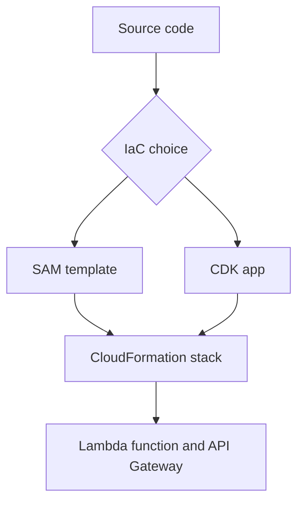

# Infrastructure as Code for Node.js Lambda

This tutorial compares two common infrastructure-as-code paths for Node.js Lambda applications: AWS SAM templates and the AWS CDK.
Use SAM when you want concise serverless resources and built-in packaging workflows, and CDK when you want imperative composition with reusable constructs.

## SAM Template Example

`template.yaml`

```yaml
AWSTemplateFormatVersion: "2010-09-09"
Transform: AWS::Serverless-2016-10-31
Resources:
  NodeApiFunction:
    Type: AWS::Serverless::Function
    Properties:
      Runtime: nodejs20.x
      Handler: src/handler.handler
      CodeUri: .
      MemorySize: 256
      Timeout: 10
      Events:
        Api:
          Type: HttpApi
          Properties:
            Path: /orders
            Method: GET
```

Deploy with:

```bash
sam build
sam deploy
```

## CDK Example

Install dependencies:

```bash
npm install aws-cdk-lib constructs
```

`lib/node-api-stack.mjs`

```javascript
import { Stack, Duration } from "aws-cdk-lib";
import { Function, Runtime, Code } from "aws-cdk-lib/aws-lambda";
import { HttpApi, HttpMethod } from "aws-cdk-lib/aws-apigatewayv2";
import { HttpLambdaIntegration } from "aws-cdk-lib/aws-apigatewayv2-integrations";

export class NodeApiStack extends Stack {
    constructor(scope, id, props) {
        super(scope, id, props);

        const fn = new Function(this, "NodeApiFunction", {
            runtime: Runtime.NODEJS_20_X,
            handler: "src/handler.handler",
            code: Code.fromAsset("."),
            timeout: Duration.seconds(10),
            memorySize: 256,
        });

        const api = new HttpApi(this, "NodeHttpApi");
        api.addRoutes({
            path: "/orders",
            methods: [HttpMethod.GET],
            integration: new HttpLambdaIntegration("OrdersIntegration", fn),
        });
    }
}
```

Deploy with:

```bash
npx cdk synth
npx cdk deploy
```

## Choosing Between SAM and CDK

| Need | Better fit |
|---|---|
| Fast serverless scaffolding | SAM |
| Local invoke and local API emulation | SAM |
| General-purpose reusable constructs | CDK |
| Higher-level application composition in code | CDK |



## Packaging Notes for Node.js

- Keep deployment package size small by excluding development-only assets.
- Prefer deterministic installs through a lock file.
- For shared dependencies, consider a layer or bundling step instead of copying large trees into many functions.

## Verification

For SAM:

```bash
sam validate
sam build
sam deploy
```

For CDK:

```bash
npx cdk synth
npx cdk deploy
```

Confirm that:

- Template or synthesized stack creates the function successfully.
- The deployed endpoint or function invokes without configuration drift.
- Future changes can be applied by rerunning the same IaC command set.

## See Also

- [Deploy Your First Node.js Lambda Function](./02-first-deploy.md)
- [CI/CD for Node.js Lambda](./06-ci-cd.md)
- [Docker Image Recipe](./recipes/docker-image.md)
- [Language Guide Overview](./index.md)

## Sources

- [What is AWS SAM](https://docs.aws.amazon.com/serverless-application-model/latest/developerguide/what-is-sam.html)
- [AWS SAM template basics](https://docs.aws.amazon.com/serverless-application-model/latest/developerguide/serverless-sam-template-basics.html)
- [AWS Cloud Development Kit (AWS CDK)](https://docs.aws.amazon.com/cdk/v2/guide/home.html)
- [AWS CDK Lambda construct library](https://docs.aws.amazon.com/cdk/api/v2/docs/aws-cdk-lib.aws_lambda-readme.html)
