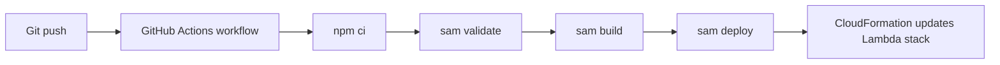

# CI/CD for Node.js Lambda with GitHub Actions

This tutorial builds a deployment pipeline that validates, packages, and deploys a Node.js Lambda application with GitHub Actions and the AWS SAM CLI.

## Pipeline Goals

- Install Node.js dependencies deterministically.
- Validate the SAM template.
- Build the function package.
- Deploy the stack to AWS from a protected branch.

## Example Workflow

`.github/workflows/nodejs-lambda.yml`

```yaml
name: deploy-nodejs-lambda

on:
  push:
    branches:
      - main

jobs:
  deploy:
    runs-on: ubuntu-latest
    permissions:
      id-token: write
      contents: read
    steps:
      - name: Check out repository
        uses: actions/checkout@v4

      - name: Set up Node.js
        uses: actions/setup-node@v4
        with:
          node-version: "20"
          cache: npm

      - name: Set up AWS SAM
        uses: aws-actions/setup-sam@v2

      - name: Configure AWS credentials
        uses: aws-actions/configure-aws-credentials@v4
        with:
          role-to-assume: arn:aws:iam::<account-id>:role/github-actions-lambda-deploy
          aws-region: ap-northeast-2

      - name: Install dependencies
        run: npm ci

      - name: Validate template
        run: sam validate

      - name: Build application
        run: sam build

      - name: Deploy application
        run: sam deploy --no-confirm-changeset --no-fail-on-empty-changeset
```

## Repository Preparation

Store deploy arguments in `samconfig.toml` so the workflow can call `sam deploy` non-interactively.
Typical settings include the stack name, region, artifact resolution, and capability flags.

## Recommended Branch Flow

1. Pull request runs validation and build only.
2. Merge to `main` runs the deployment job.
3. Production stacks optionally use protected environments and required reviewers.

## Minimal Validation Commands

Use these locally before you rely on the pipeline:

```bash
npm ci
sam validate
sam build
sam deploy --no-confirm-changeset --no-fail-on-empty-changeset
```



## Security Notes

!!! note
    Prefer OpenID Connect with `aws-actions/configure-aws-credentials` instead of long-lived access keys stored as GitHub secrets.

!!! note
    Restrict the assumed IAM role to the minimum services and stack resources needed for deployment.

## Verification

After a workflow run completes:

```bash
aws cloudformation describe-stacks --stack-name nodejs-first-deploy --region "$REGION"
aws lambda get-function --function-name "$FUNCTION_NAME" --region "$REGION"
```

Confirm that:

- The workflow logs show `sam validate`, `sam build`, and `sam deploy` succeeding.
- CloudFormation stack timestamps update for the new deployment.
- The target Lambda function reflects the latest code or configuration.

## See Also

- [Infrastructure as Code for Node.js Lambda](./05-infrastructure-as-code.md)
- [Deploy Your First Node.js Lambda Function](./02-first-deploy.md)
- [Custom Domain and SSL](./07-custom-domain-ssl.md)
- [Platform Resource Relationships](../../platform/resource-relationships.md)

## Sources

- [Using GitHub Actions to deploy with AWS SAM](https://docs.aws.amazon.com/serverless-application-model/latest/developerguide/deploying-using-github.html)
- [sam validate](https://docs.aws.amazon.com/serverless-application-model/latest/developerguide/sam-cli-command-reference-sam-validate.html)
- [sam build](https://docs.aws.amazon.com/serverless-application-model/latest/developerguide/sam-cli-command-reference-sam-build.html)
- [sam deploy](https://docs.aws.amazon.com/serverless-application-model/latest/developerguide/sam-cli-command-reference-sam-deploy.html)
