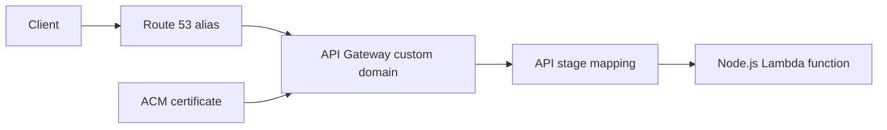

# API Gateway Custom Domain and SSL for Node.js Lambda

This tutorial connects a Node.js Lambda-backed API to an API Gateway custom domain secured by AWS Certificate Manager and routed through Amazon Route 53.

## Architecture

You will create:

- A Lambda function.
- An API Gateway HTTP API or REST API.
- An ACM certificate for your hostname.
- A custom domain name mapping.
- A Route 53 alias record.



## Create or Reuse the API

This page assumes you already deployed an API integration from SAM or CDK.
If not, complete the API deployment first.

## Request the ACM Certificate

For Regional API Gateway endpoints, request the certificate in the same Region as the API:

```bash
aws acm request-certificate \
    --domain-name api.example.com \
    --validation-method DNS \
    --region "$REGION"
```

## Create the Custom Domain

Example for HTTP API:

```bash
aws apigatewayv2 create-domain-name \
    --domain-name api.example.com \
    --domain-name-configurations CertificateArn=arn:aws:acm:$REGION:<account-id>:certificate/xxxxxxxx-xxxx-xxxx-xxxx-xxxxxxxxxxxx,EndpointType=REGIONAL,SecurityPolicy=TLS_1_2 \
    --region "$REGION"
```

Create the API mapping:

```bash
aws apigatewayv2 create-api-mapping \
    --api-id "$API_ID" \
    --domain-name api.example.com \
    --stage '$default' \
    --region "$REGION"
```

## Create the Route 53 Alias Record

Point your DNS name at the API Gateway target domain shown by `get-domain-name`:

```bash
aws route53 change-resource-record-sets \
    --hosted-zone-id ZXXXXXXXXXXXXX \
    --change-batch file://route53-alias.json
```

Example alias target payload:

```json
{
    "Changes": [
        {
            "Action": "UPSERT",
            "ResourceRecordSet": {
                "Name": "api.example.com",
                "Type": "A",
                "AliasTarget": {
                    "HostedZoneId": "ZXXXXXXXXXXXXX",
                    "DNSName": "d-xxxxxxxxxx.execute-api.ap-northeast-2.amazonaws.com",
                    "EvaluateTargetHealth": false
                }
            }
        }
    ]
}
```

## SAM Template Example

```yaml
Resources:
  NodeHttpApi:
    Type: AWS::Serverless::HttpApi
    Properties:
      Domain:
        DomainName: api.example.com
        CertificateArn: arn:aws:acm:$REGION:<account-id>:certificate/xxxxxxxx-xxxx-xxxx-xxxx-xxxxxxxxxxxx
        Route53:
          HostedZoneId: ZXXXXXXXXXXXXX
```

## Verification

Inspect the domain configuration:

```bash
aws apigatewayv2 get-domain-name \
    --domain-name api.example.com \
    --region "$REGION"
```

Test the endpoint:

```bash
curl "https://api.example.com/orders"
```

Success means:

- ACM certificate validation completed.
- API mapping points to the expected stage.
- Route 53 resolves the hostname to API Gateway.
- HTTPS requests complete with a valid certificate chain.

## See Also

- [Infrastructure as Code for Node.js Lambda](./05-infrastructure-as-code.md)
- [CI/CD for Node.js Lambda](./06-ci-cd.md)
- [API Gateway HTTP API Recipe](./recipes/api-gateway-http.md)
- [API Gateway REST API Recipe](./recipes/api-gateway-rest.md)

## Sources

- [Custom domain names for HTTP APIs](https://docs.aws.amazon.com/apigateway/latest/developerguide/http-api-custom-domain-names.html)
- [Set up a Regional custom domain name in API Gateway](https://docs.aws.amazon.com/apigateway/latest/developerguide/how-to-custom-domains.html)
- [AWS Certificate Manager](https://docs.aws.amazon.com/acm/latest/userguide/acm-overview.html)
- [Routing traffic to API Gateway API by using Route 53](https://docs.aws.amazon.com/Route53/latest/DeveloperGuide/routing-to-api-gateway.html)
