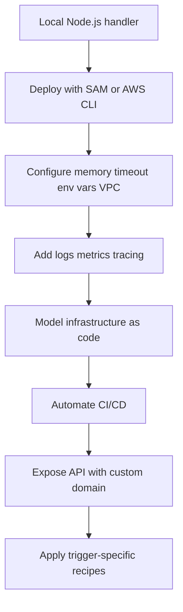

# Node.js on AWS Lambda

Use this track to build, deploy, operate, and extend AWS Lambda functions written for the Node.js runtime.
The examples use modern JavaScript, ESM imports where they improve clarity, async/await, and AWS SDK for JavaScript v3 packages.

## Who This Track Is For

- Engineers building Lambda-backed APIs with Node.js.
- Teams moving from local Express apps to event-driven functions.
- Operators who need repeatable deployment, configuration, and monitoring workflows.

## Prerequisites

- Node.js 20 or later installed locally.
- AWS CLI configured with permissions for Lambda, IAM, CloudFormation, and API Gateway.
- AWS SAM CLI installed for local testing and guided deployments.
- Docker installed if you plan to use `sam local invoke` or container image packaging.

## What You Will Build

You will build a small Lambda application that evolves through the tutorial sequence:

1. Run a handler locally with SAM CLI.
2. Deploy a function package to AWS Lambda.
3. Configure memory, timeout, layers, and networking.
4. Add structured logging and tracing.
5. Define infrastructure with SAM and AWS CDK.
6. Automate deployment with GitHub Actions.
7. Publish the API behind a custom domain and TLS certificate.

Target learning structure:

```text
docs/language-guides/nodejs/
├── index.md
├── 01-local-run.md
├── 02-first-deploy.md
├── 03-configuration.md
├── 04-logging-monitoring.md
├── 05-infrastructure-as-code.md
├── 06-ci-cd.md
├── 07-custom-domain-ssl.md
├── nodejs-runtime.md
└── recipes/
```



## Recommended Study Order

| Step | Page | Outcome |
|---|---|---|
| 1 | [Run Node.js Lambda Locally](./01-local-run.md) | Validate handler behavior before deploying. |
| 2 | [Deploy Your First Node.js Lambda Function](./02-first-deploy.md) | Publish a working function and invoke it in AWS. |
| 3 | [Configure a Node.js Lambda Function](./03-configuration.md) | Tune execution settings and dependencies. |
| 4 | [Logging and Monitoring](./04-logging-monitoring.md) | Capture structured logs, traces, and key signals. |
| 5 | [Infrastructure as Code](./05-infrastructure-as-code.md) | Manage repeatable stacks with SAM and CDK. |
| 6 | [CI/CD](./06-ci-cd.md) | Automate build, package, and deploy steps. |
| 7 | [Custom Domain and SSL](./07-custom-domain-ssl.md) | Put API Gateway behind your own hostname. |
| 8 | [Node.js Runtime Reference](./nodejs-runtime.md) | Review handler forms, versions, and packaging rules. |

## Reference Application Shape

Use a small project structure that keeps handler code, infrastructure, and tests easy to navigate:

```text
.
├── src/
│   └── handler.mjs
├── template.yaml
├── package.json
└── events/
    └── event.json
```

Minimal handler:

```javascript
export const handler = async (event) => {
    return {
        statusCode: 200,
        headers: { "content-type": "application/json" },
        body: JSON.stringify({
            message: "hello from nodejs lambda",
            requestId: event?.requestContext?.requestId ?? null,
        }),
    };
};
```

## What to Expect from the Recipes

The recipe catalog focuses on trigger- and integration-specific building blocks such as API Gateway, SQS, DynamoDB Streams, Secrets Manager, RDS Proxy, layers, and Lambda container images.
Each recipe includes:

- A real handler example.
- A SAM template fragment.
- An invocation or test pattern.
- Links to the next related implementation topic.

## Verification Checklist

Before moving to production-focused pages, verify that you can:

- Run `sam validate` successfully.
- Invoke a local event with `sam local invoke`.
- Deploy a stack with `sam deploy`.
- Review logs in CloudWatch Logs after an invocation.

## See Also

- [Run Node.js Lambda Locally](./01-local-run.md)
- [Node.js Runtime Reference](./nodejs-runtime.md)
- [Node.js Recipes](./recipes/index.md)
- [Platform Overview](../../platform/index.md)

## Sources

- [AWS Lambda Developer Guide](https://docs.aws.amazon.com/lambda/latest/dg/welcome.html)
- [Building Lambda functions with Node.js](https://docs.aws.amazon.com/lambda/latest/dg/lambda-nodejs.html)
- [What is the AWS SAM CLI](https://docs.aws.amazon.com/serverless-application-model/latest/developerguide/what-is-sam.html)
