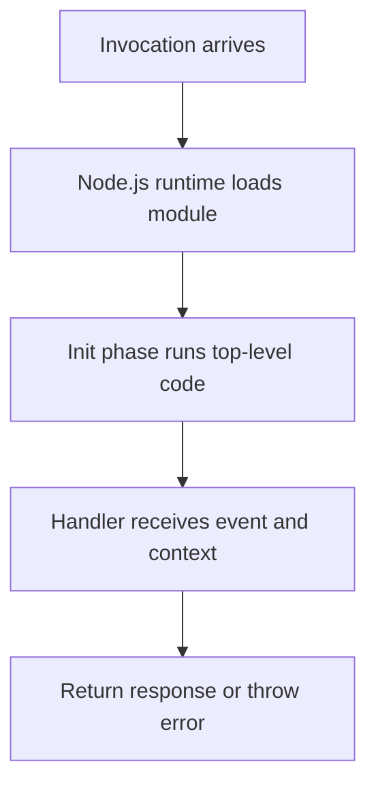

# Node.js Runtime Reference for AWS Lambda

This reference page summarizes the Node.js runtime behaviors you use most often when writing Lambda handlers.

## Supported Runtime Concepts

Lambda publishes managed Node.js runtimes and updates them over time.
Always check the current supported versions in the Lambda runtime documentation before creating a new production function.

## Handler Signatures

Common forms:

### CommonJS export

```javascript
exports.handler = async (event, context) => {
    return { statusCode: 200, body: JSON.stringify({ ok: true }) };
};
```

### ESM export

```javascript
export const handler = async (event, context) => {
    return { statusCode: 200, body: JSON.stringify({ ok: true }) };
};
```

When you use ESM, set the package type accordingly:

```json
{
    "type": "module"
}
```

## Context Object Highlights

The `context` object includes runtime metadata such as:

- `awsRequestId`
- `functionName`
- `functionVersion`
- `memoryLimitInMB`
- `invokedFunctionArn`
- `getRemainingTimeInMillis()`

Example:

```javascript
export const handler = async (event, context) => {
    return {
        statusCode: 200,
        body: JSON.stringify({
            requestId: context.awsRequestId,
            remainingTimeMs: context.getRemainingTimeInMillis(),
        }),
    };
};
```

## `package.json` and Dependencies

Use a clear package manifest:

```json
{
    "name": "nodejs-lambda-guide",
    "version": "1.0.0",
    "type": "module",
    "engines": {
        "node": ">=20"
    },
    "dependencies": {
        "@aws-sdk/client-s3": "^3.0.0"
    }
}
```

Guidance:

- Prefer AWS SDK v3 modular clients such as `@aws-sdk/client-s3`.
- Keep runtime dependencies in `dependencies`, not `devDependencies`.
- Bundle or layer large dependency trees when package size matters.

## Runtime Initialization Behavior

Code outside the handler runs during the initialization phase.
Use that space for clients and reusable objects:

```javascript
import { S3Client } from "@aws-sdk/client-s3";

const s3Client = new S3Client({});

export const handler = async () => {
    return {
        statusCode: 200,
        body: JSON.stringify({ initialized: Boolean(s3Client) }),
    };
};
```

## Environment Variables and Runtime Variables

Lambda injects service variables such as:

- `AWS_REGION`
- `AWS_EXECUTION_ENV`
- `AWS_LAMBDA_FUNCTION_NAME`
- `AWS_LAMBDA_FUNCTION_VERSION`

Add your own settings through function configuration rather than hard-coding values into the handler.



## Packaging Rules to Remember

- Handler string maps to `<file>.<export>`.
- ZIP packages must contain the referenced handler file at the expected path.
- ESM requires a compatible file and package configuration.
- Layers mount under `/opt`.

## Verification

Confirm runtime behavior with:

```bash
aws lambda get-function-configuration \
    --function-name "$FUNCTION_NAME" \
    --region "$REGION"
sam local invoke NodeLocalFunction --event events/invoke.json
```

Check that:

- The runtime is the intended Node.js version.
- The handler string points to a valid export.
- Initialization code runs successfully in both local and deployed environments.

## See Also

- [Run a Node.js Lambda Function Locally](./01-local-run.md)
- [Configure a Node.js Lambda Function](./03-configuration.md)
- [Secrets Manager Recipe](./recipes/secrets-manager.md)
- [Layers Recipe](./recipes/layers.md)

## Sources

- [Building Lambda functions with Node.js](https://docs.aws.amazon.com/lambda/latest/dg/lambda-nodejs.html)
- [Define Lambda function handler in Node.js](https://docs.aws.amazon.com/lambda/latest/dg/nodejs-handler.html)
- [Using the Lambda context object to retrieve Node.js function information](https://docs.aws.amazon.com/lambda/latest/dg/nodejs-context.html)
- [Lambda runtimes](https://docs.aws.amazon.com/lambda/latest/dg/lambda-runtimes.html)
