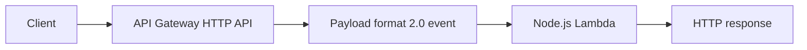

# Recipe: API Gateway HTTP API Trigger

Use this recipe for modern Lambda-backed HTTP endpoints with API Gateway payload format version 2.0.
HTTP APIs usually offer lower cost and lower latency than REST APIs when their feature set is sufficient.

## Handler

```javascript
export const handler = async (event) => {
    return {
        statusCode: 200,
        headers: { "content-type": "application/json" },
        body: JSON.stringify({
            path: event.rawPath,
            method: event.requestContext?.http?.method,
            query: event.queryStringParameters ?? {},
        }),
    };
};
```

## SAM Template

```yaml
Resources:
  HttpApiFunction:
    Type: AWS::Serverless::Function
    Properties:
      Runtime: nodejs20.x
      Handler: src/handler.handler
      CodeUri: .
      Events:
        HttpApi:
          Type: HttpApi
          Properties:
            Path: /orders
            Method: GET
```

## Local Test

```bash
sam local start-api --port 3000
curl "http://127.0.0.1:3000/orders?limit=10"
```

Expected body:

```json
{"path":"/orders","method":"GET","query":{"limit":"10"}}
```

## Deploy and Inspect

```bash
sam build
sam deploy
aws apigatewayv2 get-apis --region "$REGION"
```



## Notes

- HTTP APIs use different event fields than REST APIs.
- The route key and HTTP request metadata are available under `requestContext`.
- Keep response objects explicit with `statusCode`, headers, and body.

## See Also

- [REST API Gateway Recipe](./api-gateway-rest.md)
- [Custom Domain and SSL](../07-custom-domain-ssl.md)
- [Run a Node.js Lambda Function Locally](../01-local-run.md)
- [Recipe Catalog](./index.md)

## Sources

- [Create HTTP APIs in API Gateway](https://docs.aws.amazon.com/apigateway/latest/developerguide/http-api.html)
- [Working with AWS Lambda proxy integrations for HTTP APIs](https://docs.aws.amazon.com/apigateway/latest/developerguide/http-api-develop-integrations-lambda.html)
- [AWS::Serverless::Function HttpApi event](https://docs.aws.amazon.com/serverless-application-model/latest/developerguide/sam-property-function-httpapi.html)
