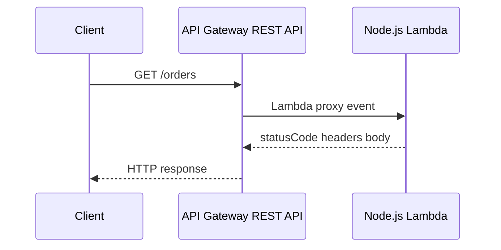

# Recipe: API Gateway REST API Trigger

Use this recipe when you need a Lambda proxy integration behind Amazon API Gateway REST API.
REST APIs remain useful for features such as usage plans, API keys, request validation, and broader legacy compatibility.

## Handler

```javascript
export const handler = async (event) => {
    return {
        statusCode: 200,
        headers: { "content-type": "application/json" },
        body: JSON.stringify({
            resource: event.resource,
            method: event.httpMethod,
            path: event.path,
        }),
    };
};
```

## SAM Template

```yaml
Resources:
  RestApiFunction:
    Type: AWS::Serverless::Function
    Properties:
      Runtime: nodejs20.x
      Handler: src/handler.handler
      CodeUri: .
      Events:
        RestApi:
          Type: Api
          Properties:
            Path: /orders
            Method: GET
```

## Event Shape Highlights

- `httpMethod`
- `path`
- `resource`
- `pathParameters`
- `queryStringParameters`
- `requestContext`

## Local Test

```bash
sam local start-api --port 3000
curl "http://127.0.0.1:3000/orders"
```

Expected body:

```json
{"resource":"/orders","method":"GET","path":"/orders"}
```

## Deploy and Verify

```bash
sam build
sam deploy
aws apigateway get-rest-apis --region "$REGION"
```



## When to Choose REST API

- You need API keys or usage plans.
- You rely on REST API-specific stage or request features.
- You are extending an existing REST API deployment model.

## See Also

- [HTTP API Gateway Recipe](./api-gateway-http.md)
- [Custom Domain and SSL](../07-custom-domain-ssl.md)
- [Run a Node.js Lambda Function Locally](../01-local-run.md)
- [Recipe Catalog](./index.md)

## Sources

- [Set up Lambda proxy integrations in API Gateway](https://docs.aws.amazon.com/apigateway/latest/developerguide/set-up-lambda-proxy-integrations.html)
- [Working with REST APIs in API Gateway](https://docs.aws.amazon.com/apigateway/latest/developerguide/apigateway-rest-api.html)
- [AWS::Serverless::Function Api event](https://docs.aws.amazon.com/serverless-application-model/latest/developerguide/sam-property-function-api.html)
