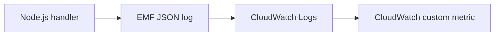

# Recipe: Publish Custom CloudWatch Metrics with EMF

Use this recipe when you need application-level metrics beyond Lambda's built-in service metrics.
Embedded Metric Format (EMF) writes structured metric objects into logs, and CloudWatch extracts them automatically.

## Handler

```javascript
export const handler = async (event) => {
    const orderCount = Array.isArray(event.orders) ? event.orders.length : 1;

    console.log(JSON.stringify({
        _aws: {
            Timestamp: Date.now(),
            CloudWatchMetrics: [
                {
                    Namespace: "LambdaGuide/Orders",
                    Dimensions: [["Service"]],
                    Metrics: [{ Name: "ProcessedOrders", Unit: "Count" }],
                },
            ],
        },
        Service: "orders-api",
        ProcessedOrders: orderCount,
    }));

    return { statusCode: 200, body: JSON.stringify({ processed: orderCount }) };
};
```

## SAM Template

```yaml
Resources:
  MetricsFunction:
    Type: AWS::Serverless::Function
    Properties:
      Runtime: nodejs20.x
      Handler: src/handler.handler
      CodeUri: .
      Environment:
        Variables:
          LOG_LEVEL: INFO
```

## Verify

Invoke the function, then inspect logs and CloudWatch metrics:

```bash
aws lambda invoke --function-name "$FUNCTION_NAME" --region "$REGION" response.json
aws logs tail "/aws/lambda/$FUNCTION_NAME" --region "$REGION"
```



## Good Uses

- Business throughput counts.
- Cache hit or miss rates.
- Downstream dependency health signals.

Keep the metric namespace stable so dashboards and alarms continue to work across deployments and function versions.

## See Also

- [Logging and Monitoring](../04-logging-monitoring.md)
- [EventBridge Rule Recipe](./eventbridge-rule.md)
- [SQS Trigger Recipe](./sqs-trigger.md)
- [Recipe Catalog](./index.md)

## Sources

- [Embedded metric format](https://docs.aws.amazon.com/AmazonCloudWatch/latest/monitoring/CloudWatch_Embedded_Metric_Format.html)
- [Monitor Lambda functions using CloudWatch](https://docs.aws.amazon.com/lambda/latest/dg/monitoring-functions.html)
- [Working with Lambda function logs](https://docs.aws.amazon.com/lambda/latest/dg/monitoring-cloudwatchlogs.html)
