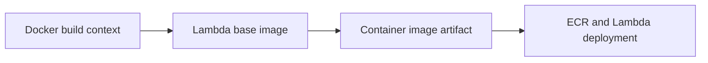

# Recipe: Deploy a Node.js Lambda Function as a Container Image

Use this recipe when ZIP packaging is not enough because you need custom system libraries, a container-based build path, or a larger deployment artifact.

## Dockerfile

```dockerfile
FROM public.ecr.aws/lambda/nodejs:20

COPY package.json package-lock.json ./
RUN npm ci --omit=dev

COPY src ./src

CMD ["src/handler.handler"]
```

## Handler

```javascript
export const handler = async () => {
    return {
        statusCode: 200,
        body: JSON.stringify({ packaging: "container-image" }),
    };
};
```

## SAM Template

```yaml
Resources:
  ImageFunction:
    Type: AWS::Serverless::Function
    Properties:
      PackageType: Image
    Metadata:
      DockerContext: .
      Dockerfile: Dockerfile
      DockerTag: nodejs20-v1
```

## Build and Deploy

```bash
sam build
sam deploy
```

You can also push the image to Amazon ECR and create the function with the image URI.

## Verify

```bash
aws lambda invoke --function-name "$FUNCTION_NAME" --region "$REGION" response.json
aws lambda get-function --function-name "$FUNCTION_NAME" --region "$REGION"
```



## Notes

- Use AWS-provided base images for the simplest runtime alignment.
- Container images are especially helpful when native dependencies complicate ZIP packaging.
- Keep the image small to reduce cold start and transfer overhead where possible.

## See Also

- [Infrastructure as Code for Node.js Lambda](../05-infrastructure-as-code.md)
- [Layers Recipe](./layers.md)
- [Run a Node.js Lambda Function Locally](../01-local-run.md)
- [Recipe Catalog](./index.md)

## Sources

- [Deploy Node.js Lambda functions with container images](https://docs.aws.amazon.com/lambda/latest/dg/nodejs-image.html)
- [Create a Lambda function using a container image](https://docs.aws.amazon.com/lambda/latest/dg/images-create.html)
- [AWS SAM support for container images](https://docs.aws.amazon.com/serverless-application-model/latest/developerguide/serverless-image-repositories.html)
