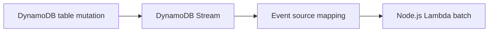

# Recipe: DynamoDB Streams Event Processing

Use this recipe when a Node.js Lambda function must react to item inserts, updates, or deletes from a DynamoDB table.

## Handler

```javascript
export const handler = async (event) => {
    for (const record of event.Records) {
        console.log(JSON.stringify({
            eventName: record.eventName,
            keys: record.dynamodb?.Keys,
        }));
    }
};
```

## SAM Template

```yaml
Resources:
  StreamConsumerFunction:
    Type: AWS::Serverless::Function
    Properties:
      Runtime: nodejs20.x
      Handler: src/handler.handler
      CodeUri: .
      Events:
        TableStream:
          Type: DynamoDB
          Properties:
            Stream: arn:aws:dynamodb:$REGION:<account-id>:table/orders/stream/2026-01-01T00:00:00.000
            StartingPosition: LATEST
            BatchSize: 10
            MaximumRetryAttempts: 2
```

## Processing Notes

- Records arrive in batches.
- Preserve idempotency because retries can replay records.
- Use stream images to compare old and new item states when needed.

## Verify Mapping

```bash
aws lambda list-event-source-mappings \
    --function-name "$FUNCTION_NAME" \
    --region "$REGION"
```



## Test Strategy

Insert or update an item in the source table, then inspect logs:

```bash
aws logs tail "/aws/lambda/$FUNCTION_NAME" --follow --region "$REGION"
```

Look for `eventName` and primary key fields from each stream record.

## See Also

- [SQS Trigger Recipe](./sqs-trigger.md)
- [EventBridge Rule Recipe](./eventbridge-rule.md)
- [Logging and Monitoring](../04-logging-monitoring.md)
- [Recipe Catalog](./index.md)

## Sources

- [Using AWS Lambda with Amazon DynamoDB](https://docs.aws.amazon.com/lambda/latest/dg/with-ddb.html)
- [Process DynamoDB records with Lambda](https://docs.aws.amazon.com/lambda/latest/dg/services-dynamodb-eventsourcemapping.html)
- [AWS::Serverless::Function DynamoDB event](https://docs.aws.amazon.com/serverless-application-model/latest/developerguide/sam-property-function-dynamodb.html)
