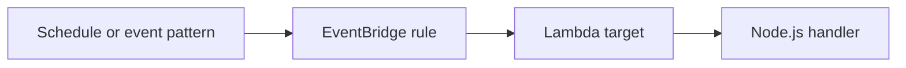

# Recipe: Amazon EventBridge Rule

Use this recipe for scheduled Lambda execution or rule-based routing of AWS service events and custom application events.

## Handler

```javascript
export const handler = async (event) => {
    console.log(JSON.stringify({
        source: event.source,
        detailType: event["detail-type"],
        detail: event.detail,
    }));
};
```

## SAM Template

```yaml
Resources:
  EventRuleFunction:
    Type: AWS::Serverless::Function
    Properties:
      Runtime: nodejs20.x
      Handler: src/handler.handler
      CodeUri: .
      Events:
        Schedule:
          Type: Schedule
          Properties:
            Schedule: rate(5 minutes)
```

## Variants

- Scheduled rule with `rate(...)` or `cron(...)`.
- Event pattern matching for AWS service events.
- Custom business events on your own event bus.

## Verification

Inspect the rule and target wiring:

```bash
aws events list-rules --region "$REGION"
aws lambda get-policy --function-name "$FUNCTION_NAME" --region "$REGION"
```



## Test with a Custom Event

```bash
aws events put-events \
    --entries '[{"Source":"app.orders","DetailType":"OrderCreated","Detail":"{\"orderId\":\"1001\"}"}]' \
    --region "$REGION"
```

Tail logs to confirm the event reached the function.

Scheduled rules do not require a producer service because EventBridge invokes the target directly based on the configured schedule expression.
For pattern-based rules, keep the filter specific enough that unrelated service events do not trigger unnecessary Lambda invocations.

## See Also

- [Step Functions Recipe](./step-functions.md)
- [Custom Metrics Recipe](./custom-metrics.md)
- [Logging and Monitoring](../04-logging-monitoring.md)
- [Recipe Catalog](./index.md)

## Sources

- [Using AWS Lambda with Amazon EventBridge](https://docs.aws.amazon.com/lambda/latest/dg/with-eventbridge.html)
- [Amazon EventBridge rules](https://docs.aws.amazon.com/eventbridge/latest/userguide/eb-rules.html)
- [AWS::Serverless::Function Schedule event](https://docs.aws.amazon.com/serverless-application-model/latest/developerguide/sam-property-function-schedule.html)
