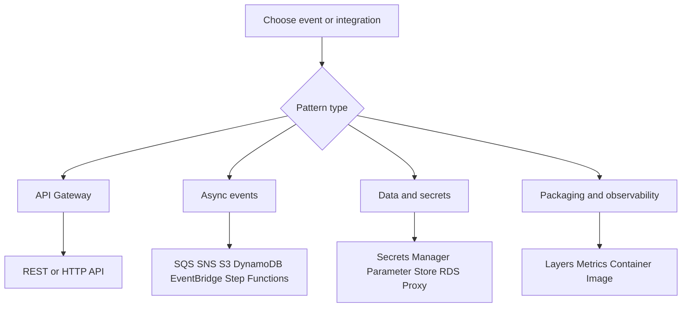

# Node.js Lambda Recipes

Use these recipes when you already understand the core Node.js Lambda workflow and need a focused implementation pattern for a specific trigger or integration.

## How to Use This Catalog

Each recipe includes:

- A practical Node.js handler.
- A SAM template fragment.
- A test or verification flow.
- Links to the next related page.

## Recipe Map

| Category | Recipe | Primary use |
|---|---|---|
| API front doors | [REST API Gateway](./api-gateway-rest.md) | Lambda proxy integration with REST API features. |
| API front doors | [HTTP API Gateway](./api-gateway-http.md) | Lower-latency HTTP API payload v2 integration. |
| Streams | [DynamoDB Streams](./dynamodb-streams.md) | React to item changes in a DynamoDB table. |
| Storage | [S3 Event Notifications](./s3-event.md) | Process newly created or removed objects. |
| Queues | [SQS Trigger](./sqs-trigger.md) | Batch process queued messages with retries. |
| Messaging | [SNS Trigger](./sns-trigger.md) | Subscribe Lambda to topic fan-out events. |
| Scheduling | [EventBridge Rule](./eventbridge-rule.md) | Run on a schedule or match service events. |
| Orchestration | [Step Functions](./step-functions.md) | Invoke Lambda inside workflows. |
| Secrets and config | [Secrets Manager](./secrets-manager.md) | Load secrets securely at runtime. |
| Secrets and config | [Parameter Store](./parameter-store.md) | Read application parameters from SSM. |
| Data access | [RDS Proxy](./rds-proxy.md) | Reach relational databases safely from Lambda. |
| Packaging | [Layers](./layers.md) | Share libraries and assets across functions. |
| Observability | [Custom Metrics](./custom-metrics.md) | Publish metrics through EMF logs. |
| Packaging | [Docker Image](./docker-image.md) | Deploy Lambda as a container image. |



## Selection Guidance

- Choose HTTP API unless you explicitly need REST API capabilities such as API keys, usage plans, or some legacy integration patterns.
- Use SQS when you need buffering and retry isolation.
- Use EventBridge when multiple producers and rule-based routing matter more than direct point-to-point invocation.
- Use Secrets Manager for sensitive values and Parameter Store for simpler configuration values.

## Verification Baseline

For any recipe, validate these common steps:

```bash
sam validate
sam build
sam deploy
aws lambda get-function-configuration --function-name "$FUNCTION_NAME" --region "$REGION"
```

## Recipe Progression

If you are building an HTTP service, start with API Gateway, then layer in secrets, metrics, and packaging choices.
If you are building asynchronous processing, start with SQS, SNS, DynamoDB Streams, or EventBridge depending on where the event originates.

## See Also

- [Node.js on AWS Lambda](../index.md)
- [Infrastructure as Code for Node.js Lambda](../05-infrastructure-as-code.md)
- [Logging and Monitoring](../04-logging-monitoring.md)
- [Node.js Runtime Reference](../nodejs-runtime.md)

## Sources

- [Using event source mappings](https://docs.aws.amazon.com/lambda/latest/dg/invocation-eventsourcemapping.html)
- [Invoking Lambda functions with AWS services](https://docs.aws.amazon.com/lambda/latest/dg/lambda-services.html)
- [AWS SAM developer guide](https://docs.aws.amazon.com/serverless-application-model/latest/developerguide/what-is-sam.html)
