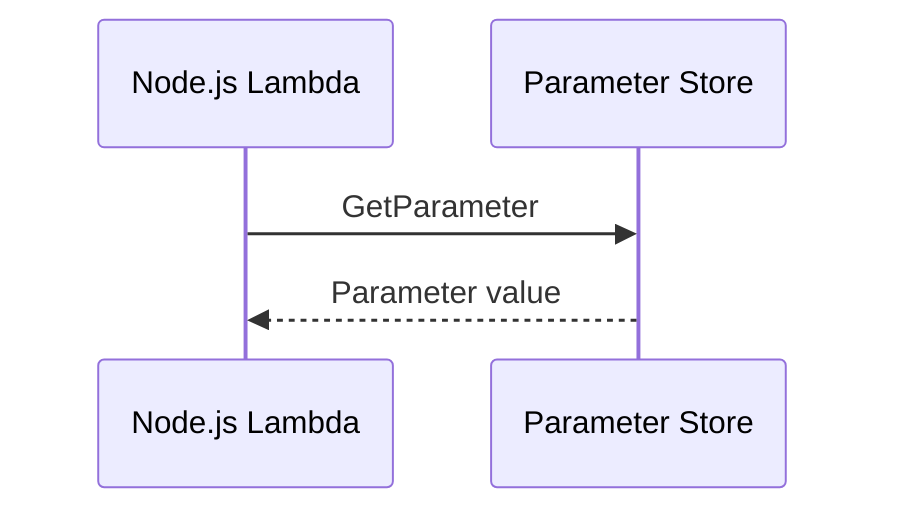

# Recipe: Read Configuration from Systems Manager Parameter Store

Use this recipe when a Node.js Lambda function needs centralized configuration that is not as sensitive or rotation-heavy as a full secret.

## Install the AWS SDK v3 Client

```bash
npm install @aws-sdk/client-ssm
```

## Handler

```javascript
import { SSMClient, GetParameterCommand } from "@aws-sdk/client-ssm";

const client = new SSMClient({});

export const handler = async () => {
    const command = new GetParameterCommand({
        Name: "/app/orders/log-level",
        WithDecryption: true,
    });
    const response = await client.send(command);

    return {
        statusCode: 200,
        body: JSON.stringify({ value: response.Parameter?.Value }),
    };
};
```

## SAM Template

```yaml
Resources:
  ParameterReaderFunction:
    Type: AWS::Serverless::Function
    Properties:
      Runtime: nodejs20.x
      Handler: src/handler.handler
      CodeUri: .
      Policies:
        - Statement:
            - Effect: Allow
              Action:
                - ssm:GetParameter
              Resource: arn:aws:ssm:$REGION:<account-id>:parameter/app/orders/*
```

## Verify

Create or update the parameter, then invoke the function:

```bash
aws ssm put-parameter \
    --name "/app/orders/log-level" \
    --value "INFO" \
    --type "String" \
    --overwrite \
    --region "$REGION"
aws lambda invoke --function-name "$FUNCTION_NAME" --region "$REGION" response.json
```



## Notes

- Use parameter hierarchies such as `/app/orders/...` to organize environments cleanly.
- `WithDecryption` applies to `SecureString` parameters.

## See Also

- [Secrets Manager Recipe](./secrets-manager.md)
- [Configuration Tutorial](../03-configuration.md)
- [Node.js Runtime Reference](../nodejs-runtime.md)
- [Recipe Catalog](./index.md)

## Sources

- [Using Lambda with Parameter Store](https://docs.aws.amazon.com/systems-manager/latest/userguide/integration-lambda-extensions.html)
- [GetParameter](https://docs.aws.amazon.com/systems-manager/latest/APIReference/API_GetParameter.html)
- [AWS SDK for JavaScript v3 SSM examples](https://docs.aws.amazon.com/sdk-for-javascript/v3/developer-guide/javascript_ssm_code_examples.html)
