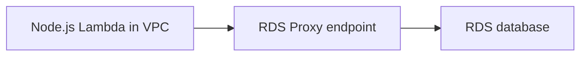

# Recipe: Connect to Amazon RDS Through RDS Proxy

Use this recipe when a Node.js Lambda function must reach an RDS database while avoiding excessive direct connection churn from bursty concurrency.

## Handler

```javascript
import mysql from "mysql2/promise";

let connection;

export const handler = async () => {
    connection ??= await mysql.createConnection({
        host: process.env.DB_PROXY_ENDPOINT,
        user: process.env.DB_USER,
        password: process.env.DB_PASSWORD,
        database: process.env.DB_NAME,
        ssl: "Amazon RDS",
    });

    const [rows] = await connection.execute("SELECT 1 AS ok");
    return {
        statusCode: 200,
        body: JSON.stringify(rows[0]),
    };
};
```

## SAM Template

```yaml
Resources:
  RdsProxyFunction:
    Type: AWS::Serverless::Function
    Properties:
      Runtime: nodejs20.x
      Handler: src/handler.handler
      CodeUri: .
      VpcConfig:
        SecurityGroupIds:
          - sg-xxxxxxxx
        SubnetIds:
          - subnet-xxxxxxxx
          - subnet-yyyyyyyy
      Environment:
        Variables:
          DB_PROXY_ENDPOINT: proxy-example.proxy-abcdefghijkl.$REGION.rds.amazonaws.com
          DB_USER: app_user
          DB_NAME: appdb
```

## Why Use RDS Proxy

- Pools and manages database connections.
- Helps protect the database from Lambda concurrency spikes.
- Supports IAM authentication and Secrets Manager integration.

## Verification

Invoke the function after network paths, security groups, and credentials are configured:

```bash
aws lambda invoke --function-name "$FUNCTION_NAME" --region "$REGION" response.json
aws lambda get-function-configuration --function-name "$FUNCTION_NAME" --region "$REGION"
```



## Notes

- Keep the function in private subnets with outbound access as required.
- Reuse the database connection across warm invocations.
- Store credentials in Secrets Manager rather than plain environment variables for production.

## See Also

- [Configuration Tutorial](../03-configuration.md)
- [Secrets Manager Recipe](./secrets-manager.md)
- [Parameter Store Recipe](./parameter-store.md)
- [Recipe Catalog](./index.md)

## Sources

- [Using AWS Lambda with Amazon RDS Proxy](https://docs.aws.amazon.com/lambda/latest/dg/services-rds.html)
- [Amazon RDS Proxy concepts](https://docs.aws.amazon.com/AmazonRDS/latest/UserGuide/rds-proxy.html)
- [Configuring Lambda functions to access resources in a VPC](https://docs.aws.amazon.com/lambda/latest/dg/configuration-vpc.html)
