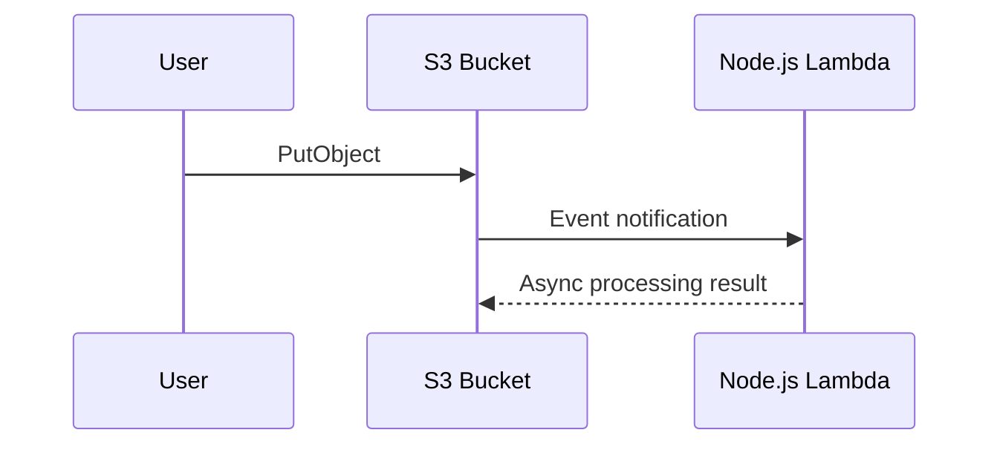

# Recipe: Amazon S3 Event Notifications

Use this recipe to process object uploads or deletions from an S3 bucket with a Node.js Lambda function.

## Handler

```javascript
export const handler = async (event) => {
    for (const record of event.Records) {
        const bucket = record.s3.bucket.name;
        const key = decodeURIComponent(record.s3.object.key.replace(/\+/g, " "));
        console.log(JSON.stringify({ bucket, key, eventName: record.eventName }));
    }
};
```

## SAM Template

```yaml
Resources:
  S3ProcessorFunction:
    Type: AWS::Serverless::Function
    Properties:
      Runtime: nodejs20.x
      Handler: src/handler.handler
      CodeUri: .
      Events:
        UploadEvent:
          Type: S3
          Properties:
            Bucket: !Ref SourceBucket
            Events:
              - s3:ObjectCreated:*
  SourceBucket:
    Type: AWS::S3::Bucket
```

## Behavior Notes

- Object keys can be URL encoded in the event record.
- S3 can invoke the function asynchronously.
- Use bucket notifications only for the event types you truly need.

## Verify

Upload a test file and tail logs:

```bash
aws s3 cp ./sample.txt "s3://$BUCKET_NAME/sample.txt"
aws logs tail "/aws/lambda/$FUNCTION_NAME" --follow --region "$REGION"
```



## Common Uses

- Image or document post-processing.
- Metadata extraction.
- Validation and routing to downstream services.

## See Also

- [Layers Recipe](./layers.md)
- [Secrets Manager Recipe](./secrets-manager.md)
- [Logging and Monitoring](../04-logging-monitoring.md)
- [Recipe Catalog](./index.md)

## Sources

- [Process Amazon S3 event notifications with Lambda](https://docs.aws.amazon.com/lambda/latest/dg/with-s3.html)
- [Amazon S3 event notifications](https://docs.aws.amazon.com/AmazonS3/latest/userguide/EventNotifications.html)
- [AWS::Serverless::Function S3 event](https://docs.aws.amazon.com/serverless-application-model/latest/developerguide/sam-property-function-s3.html)
