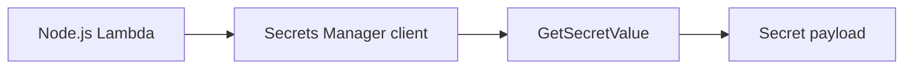

# Recipe: Read a Secret from AWS Secrets Manager

Use this recipe when a Node.js Lambda function needs credentials or other sensitive values stored in AWS Secrets Manager.

## Install the AWS SDK v3 Client

```bash
npm install @aws-sdk/client-secrets-manager
```

## Handler

```javascript
import { SecretsManagerClient, GetSecretValueCommand } from "@aws-sdk/client-secrets-manager";

const client = new SecretsManagerClient({});

export const handler = async () => {
    const command = new GetSecretValueCommand({ SecretId: "app/orders/database" });
    const response = await client.send(command);
    const secret = JSON.parse(response.SecretString);

    return {
        statusCode: 200,
        body: JSON.stringify({ username: secret.username }),
    };
};
```

## SAM Template

```yaml
Resources:
  SecretReaderFunction:
    Type: AWS::Serverless::Function
    Properties:
      Runtime: nodejs20.x
      Handler: src/handler.handler
      CodeUri: .
      Policies:
        - Statement:
            - Effect: Allow
              Action:
                - secretsmanager:GetSecretValue
              Resource: arn:aws:secretsmanager:$REGION:<account-id>:secret:app/orders/database-*
```

## Verification

Invoke the function after storing a matching secret:

```bash
aws lambda invoke --function-name "$FUNCTION_NAME" --region "$REGION" response.json
```

Check the response shape and logs, but do not log the secret contents themselves.



## Notes

- Cache secrets in memory when repeated retrieval would add unnecessary latency.
- Rotate secrets in Secrets Manager instead of hard-coding them in Lambda configuration.

## See Also

- [Parameter Store Recipe](./parameter-store.md)
- [RDS Proxy Recipe](./rds-proxy.md)
- [Node.js Runtime Reference](../nodejs-runtime.md)
- [Recipe Catalog](./index.md)

## Sources

- [Use Secrets Manager secrets in Lambda functions](https://docs.aws.amazon.com/lambda/latest/dg/with-secrets-manager.html)
- [GetSecretValue](https://docs.aws.amazon.com/secretsmanager/latest/apireference/API_GetSecretValue.html)
- [AWS SDK for JavaScript v3 Secrets Manager examples](https://docs.aws.amazon.com/sdk-for-javascript/v3/developer-guide/javascript_secrets-manager_code_examples.html)
