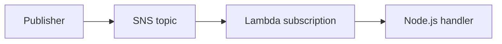

# Recipe: Amazon SNS Topic Subscription

Use this recipe when you want a Node.js Lambda function to process messages published to an SNS topic.
SNS is a fan-out pattern, so the same message can reach Lambda, SQS, HTTPS, and email subscribers at the same time.

## Handler

```javascript
export const handler = async (event) => {
    for (const record of event.Records) {
        const message = JSON.parse(record.Sns.Message);
        console.log(JSON.stringify({
            messageId: record.Sns.MessageId,
            subject: record.Sns.Subject,
            message,
        }));
    }
};
```

## SAM Template

```yaml
Resources:
  SnsSubscriberFunction:
    Type: AWS::Serverless::Function
    Properties:
      Runtime: nodejs20.x
      Handler: src/handler.handler
      CodeUri: .
      Events:
        Topic:
          Type: SNS
          Properties:
            Topic: arn:aws:sns:$REGION:<account-id>:orders-topic
```

## Test Publish

```bash
aws sns publish \
    --topic-arn "arn:aws:sns:$REGION:<account-id>:orders-topic" \
    --message '{"orderId":"1001"}' \
    --region "$REGION"
```

Then check logs:

```bash
aws logs tail "/aws/lambda/$FUNCTION_NAME" --follow --region "$REGION"
```



## Operational Notes

- SNS invokes Lambda asynchronously.
- Message bodies are strings and often need JSON parsing.
- For durable buffering between SNS and Lambda, add SQS in the middle.

This pattern works well for fan-out notifications such as order events, audit notifications, or cache invalidation signals that multiple consumers need to observe.
If subscribers need independent retry and dead-letter behavior, route the SNS topic into separate SQS queues and subscribe Lambda to each queue.

## See Also

- [SQS Trigger Recipe](./sqs-trigger.md)
- [EventBridge Rule Recipe](./eventbridge-rule.md)
- [Logging and Monitoring](../04-logging-monitoring.md)
- [Recipe Catalog](./index.md)

## Sources

- [Using AWS Lambda with Amazon SNS](https://docs.aws.amazon.com/lambda/latest/dg/with-sns.html)
- [Amazon SNS message delivery for AWS Lambda](https://docs.aws.amazon.com/sns/latest/dg/sns-lambda-as-subscriber.html)
- [AWS::Serverless::Function SNS event](https://docs.aws.amazon.com/serverless-application-model/latest/developerguide/sam-property-function-sns.html)
