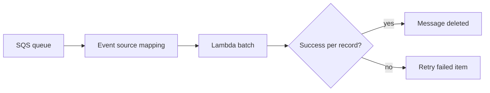

# Recipe: Amazon SQS Queue Trigger with Batch Processing

Use this recipe when Lambda should drain messages from an SQS queue in batches.
This is a common pattern for decoupled background work and retry-friendly processing.

## Handler

```javascript
export const handler = async (event) => {
    const batchItemFailures = [];

    for (const record of event.Records) {
        try {
            const payload = JSON.parse(record.body);
            console.log(JSON.stringify({ messageId: record.messageId, payload }));
        } catch {
            batchItemFailures.push({ itemIdentifier: record.messageId });
        }
    }

    return { batchItemFailures };
};
```

## SAM Template

```yaml
Resources:
  QueueConsumerFunction:
    Type: AWS::Serverless::Function
    Properties:
      Runtime: nodejs20.x
      Handler: src/handler.handler
      CodeUri: .
      Events:
        Queue:
          Type: SQS
          Properties:
            Queue: arn:aws:sqs:$REGION:<account-id>:orders-queue
            BatchSize: 10
            FunctionResponseTypes:
              - ReportBatchItemFailures
```

## Why Partial Batch Responses Matter

Returning `batchItemFailures` lets Lambda retry only failed messages instead of reprocessing the whole batch.

## Verify Mapping

```bash
aws lambda list-event-source-mappings \
    --function-name "$FUNCTION_NAME" \
    --region "$REGION"
```

Send a test message:

```bash
aws sqs send-message \
    --queue-url "$QUEUE_URL" \
    --message-body '{"orderId":"1001"}' \
    --region "$REGION"
```



## See Also

- [SNS Trigger Recipe](./sns-trigger.md)
- [DynamoDB Streams Recipe](./dynamodb-streams.md)
- [Logging and Monitoring](../04-logging-monitoring.md)
- [Recipe Catalog](./index.md)

## Sources

- [Using Lambda with Amazon SQS](https://docs.aws.amazon.com/lambda/latest/dg/with-sqs.html)
- [Reporting batch item failures for Lambda functions with an Amazon SQS trigger](https://docs.aws.amazon.com/lambda/latest/dg/services-sqs-errorhandling.html)
- [AWS::Serverless::Function SQS event](https://docs.aws.amazon.com/serverless-application-model/latest/developerguide/sam-property-function-sqs.html)
