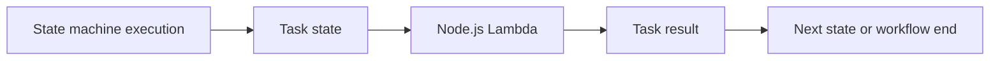

# Recipe: AWS Step Functions Integration

Use this recipe when a Node.js Lambda function is one step inside a larger workflow managed by AWS Step Functions.

## Handler

```javascript
export const handler = async (event) => {
    return {
        orderId: event.orderId,
        status: "validated",
        validatedAt: new Date().toISOString(),
    };
};
```

## SAM Template

```yaml
Resources:
  WorkflowFunction:
    Type: AWS::Serverless::Function
    Properties:
      Runtime: nodejs20.x
      Handler: src/handler.handler
      CodeUri: .
  OrderStateMachine:
    Type: AWS::Serverless::StateMachine
    Properties:
      Definition:
        StartAt: ValidateOrder
        States:
          ValidateOrder:
            Type: Task
            Resource: !GetAtt WorkflowFunction.Arn
            End: true
```

## Start an Execution

```bash
aws stepfunctions start-execution \
    --state-machine-arn "$STATE_MACHINE_ARN" \
    --input '{"orderId":"1001"}' \
    --region "$REGION"
```

## What to Watch

- Step input becomes Lambda event input for task states.
- Lambda return values can feed the next state.
- Failures can be retried or caught in the state machine definition.



## Verification

Describe the execution after starting it:

```bash
aws stepfunctions describe-execution \
    --execution-arn "$EXECUTION_ARN" \
    --region "$REGION"
```

Check that the output contains `status` set to `validated`.

## See Also

- [EventBridge Rule Recipe](./eventbridge-rule.md)
- [First Deploy](../02-first-deploy.md)
- [Infrastructure as Code for Node.js Lambda](../05-infrastructure-as-code.md)
- [Recipe Catalog](./index.md)

## Sources

- [Using AWS Lambda with AWS Step Functions](https://docs.aws.amazon.com/lambda/latest/dg/with-step-functions.html)
- [AWS Step Functions state machine structure](https://docs.aws.amazon.com/step-functions/latest/dg/statemachine-structure.html)
- [AWS SAM Step Functions support](https://docs.aws.amazon.com/serverless-application-model/latest/developerguide/sam-resource-statemachine.html)
