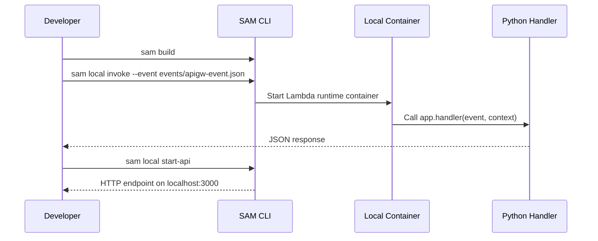

# Run a Python Lambda Function Locally

This tutorial uses AWS SAM CLI to execute a Python Lambda function on your workstation before any AWS deployment.
The goal is to validate handler shape, dependency packaging, and API Gateway event mapping early.

## Prerequisites

- Python 3.12 installed.
- AWS SAM CLI installed.
- Docker running for `sam local` commands.
- An empty project folder with write access.

## What You'll Build

You will build a minimal Python Lambda API that:

- Invokes locally with `sam local invoke`.
- Emulates API Gateway with `sam local start-api`.
- Uses a real `template.yaml`, `requirements.txt`, and sample event payload.

Project target structure:

```text
.
├── app.py
├── requirements.txt
├── template.yaml
└── events/
    └── apigw-event.json
```

## Steps

1. Create the handler in `app.py`.

```python
import json


def handler(event, context):
    response = {
        "message": "hello from python lambda",
        "path": event.get("rawPath") or event.get("path", "/"),
        "request_id": getattr(context, "aws_request_id", "local-test"),
    }
    return {
        "statusCode": 200,
        "headers": {"Content-Type": "application/json"},
        "body": json.dumps(response),
    }
```

2. Add dependencies to `requirements.txt`.

```text
requests==2.32.3
```

3. Define the SAM template.

```yaml
AWSTemplateFormatVersion: '2010-09-09'
Transform: AWS::Serverless-2016-10-31
Resources:
  PythonLocalFunction:
    Type: AWS::Serverless::Function
    Properties:
      CodeUri: .
      Handler: app.handler
      Runtime: python3.12
      Timeout: 10
      MemorySize: 256
      Events:
        HttpApi:
          Type: HttpApi
          Properties:
            Path: /
            Method: GET
```

4. Create a sample API Gateway event at `events/apigw-event.json`.

```json
{
  "version": "2.0",
  "routeKey": "GET /",
  "rawPath": "/",
  "rawQueryString": "",
  "headers": {
    "host": "localhost"
  },
  "requestContext": {
    "http": {
      "method": "GET",
      "path": "/"
    }
  },
  "isBase64Encoded": false
}
```

5. Build the function package.

```bash
sam build
```

6. Invoke the function locally with the sample event.

```bash
sam local invoke "PythonLocalFunction" --event "events/apigw-event.json"
```

Expected output:

```json
{"statusCode": 200, "headers": {"Content-Type": "application/json"}, "body": "{"message": "hello from python lambda", "path": "/", "request_id": "local-test"}"}
```

7. Start the local API emulator.

```bash
sam local start-api
```

8. In a second terminal, test the endpoint.

```bash
curl --silent "http://127.0.0.1:3000/"
```



## Verification

Run these checks before you deploy anything to AWS:

```bash
sam validate
nslookup localhost
curl --silent "http://127.0.0.1:3000/"
```

Expected results:

- `sam validate` succeeds.
- `sam local invoke` returns a 200 response envelope.
- `sam local start-api` exposes the handler at `http://127.0.0.1:3000/`.

## See Also

- [Deploy Your First Python Lambda Function](./02-first-deploy.md)
- [Python Runtime Reference](./python-runtime.md)
- [API Gateway HTTP API Recipe](./recipes/api-gateway-http.md)
- [Python Guide Index](./index.md)

## Sources

- [Testing serverless applications locally with AWS SAM CLI](https://docs.aws.amazon.com/serverless-application-model/latest/developerguide/using-sam-cli-local-testing.html)
- [Invoking Lambda functions locally](https://docs.aws.amazon.com/serverless-application-model/latest/developerguide/using-sam-cli-local-invoke.html)
- [Using `sam local start-api`](https://docs.aws.amazon.com/serverless-application-model/latest/developerguide/using-sam-cli-local-start-api.html)
