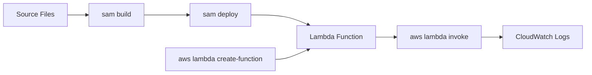

# Deploy Your First Python Lambda Function

This tutorial publishes a Python Lambda function with AWS SAM and shows the equivalent AWS CLI operations for teams that need lower-level control.
It finishes by invoking the function and tailing logs from CloudWatch Logs.

## Prerequisites

- A working project from [Run a Python Lambda Function Locally](./01-local-run.md).
- AWS credentials configured for the target account and region.
- An execution role ARN stored as `$ROLE_ARN` for raw AWS CLI examples.
- An S3 bucket available for SAM packaging if prompted during guided deployment.

## What You'll Build

You will build and deploy:

- One Python Lambda function named `$FUNCTION_NAME`.
- One CloudWatch Logs log group created by the first invocation.
- A repeatable deploy flow using `sam build`, `sam deploy`, and `aws lambda invoke`.

## Steps

1. Export deployment variables.

```bash
export FUNCTION_NAME="python-first-function"
export REGION="ap-northeast-2"
export ROLE_ARN="arn:aws:iam::<account-id>:role/lambda-exec"
```

2. Build the SAM application.

```bash
sam build
```

3. Deploy with guided configuration the first time.

```bash
sam deploy --guided
```

Recommended answers:

- Stack Name: `python-first-function`
- AWS Region: `$REGION`
- Confirm changes before deploy: `Y`
- Allow IAM role creation: `Y` if SAM creates roles for you
- Save arguments to configuration file: `Y`

4. Invoke the deployed function through AWS CLI.

```bash
aws lambda invoke   --function-name "$FUNCTION_NAME"   --cli-binary-format raw-in-base64-out   --payload '{"rawPath":"/health"}'   "response.json"
```

Expected output metadata:

```json
{
  "StatusCode": 200,
  "ExecutedVersion": "$LATEST"
}
```

5. Inspect the function response.

```bash
python3 -m json.tool "response.json"
```

6. Tail CloudWatch Logs for the function.

```bash
aws logs tail "/aws/lambda/$FUNCTION_NAME" --follow --region "$REGION"
```

7. Use a direct AWS CLI deployment when you need an explicit ZIP workflow.

```bash
zip --recurse-paths "function.zip" app.py requirements.txt
aws lambda create-function   --function-name "$FUNCTION_NAME"   --runtime "python3.12"   --role "$ROLE_ARN"   --handler "app.handler"   --zip-file "fileb://function.zip"   --timeout 10   --memory-size 256   --region "$REGION"
```



## Verification

Run these checks after deployment:

```bash
aws lambda get-function --function-name "$FUNCTION_NAME" --region "$REGION"
aws lambda invoke --function-name "$FUNCTION_NAME" --cli-binary-format raw-in-base64-out --payload '{"rawPath":"/verify"}' "verify.json"
aws logs describe-log-groups --log-group-name-prefix "/aws/lambda/$FUNCTION_NAME" --region "$REGION"
```

Expected results:

- `get-function` returns function configuration and code location metadata.
- `invoke` returns `StatusCode: 200`.
- A log group exists at `/aws/lambda/$FUNCTION_NAME`.

## See Also

- [Run a Python Lambda Function Locally](./01-local-run.md)
- [Configure Python Lambda Functions](./03-configuration.md)
- [CI/CD for Python Lambda](./06-ci-cd.md)
- [Python Guide Index](./index.md)

## Sources

- [Deploying serverless applications with AWS SAM CLI](https://docs.aws.amazon.com/serverless-application-model/latest/developerguide/deploy-upload-local-files.html)
- [CreateFunction API](https://docs.aws.amazon.com/lambda/latest/api/API_CreateFunction.html)
- [Invoking a Lambda function with the AWS CLI](https://docs.aws.amazon.com/lambda/latest/dg/example_lambda_Invoke_section.html)
- [Viewing CloudWatch Logs for Lambda](https://docs.aws.amazon.com/lambda/latest/dg/monitoring-cloudwatchlogs-view.html)
