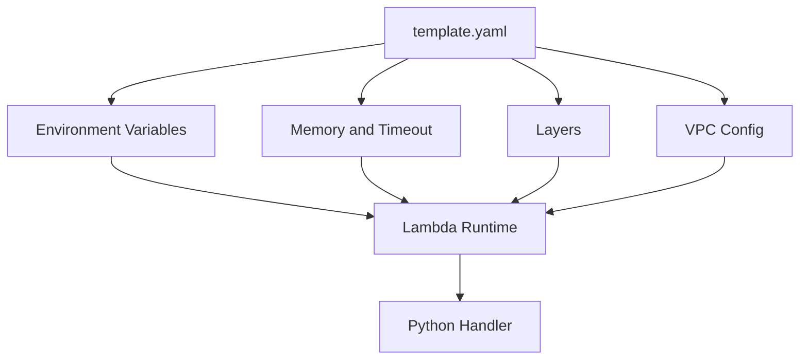

# Configure Python Lambda Functions

This tutorial covers the Lambda settings that most directly affect Python function behavior: environment variables, memory, timeout, layers, and VPC networking.
It uses AWS SAM so application code and configuration stay in the same reviewed template.

## Prerequisites

- A deployable Python Lambda project.
- Familiarity with [Deploy Your First Python Lambda Function](./02-first-deploy.md).
- Subnet IDs and security group IDs ready if you attach the function to a VPC.
- A layer ARN available as `$LAYER_ARN` if you reuse shared dependencies.

## What You'll Build

You will build a SAM template that configures:

- Application environment variables.
- Memory and timeout settings for Python execution.
- One optional Lambda layer reference.
- VPC attachment for private resource access.

## Steps

1. Start from a function definition that centralizes operational settings.

```yaml
AWSTemplateFormatVersion: '2010-09-09'
Transform: AWS::Serverless-2016-10-31
Resources:
  ConfiguredPythonFunction:
    Type: AWS::Serverless::Function
    Properties:
      CodeUri: .
      Handler: app.handler
      Runtime: python3.12
      MemorySize: 512
      Timeout: 30
      Layers:
        - $LAYER_ARN
      Environment:
        Variables:
          LOG_LEVEL: INFO
          APP_ENV: production
          ORDERS_TABLE: orders-prod
      VpcConfig:
        SecurityGroupIds:
          - sg-xxxxxxxxxxxxxxxxx
        SubnetIds:
          - subnet-xxxxxxxx
          - subnet-yyyyyyyy
```

2. Read environment variables from Python.

```python
import os


def handler(event, context):
    return {
        "statusCode": 200,
        "body": (
            f"env={os.environ['APP_ENV']}, "
            f"table={os.environ['ORDERS_TABLE']}, "
            f"memory={context.memory_limit_in_mb}"
        ),
    }
```

3. Update configuration in place with AWS CLI when you need an emergency change.

```bash
aws lambda update-function-configuration   --function-name "$FUNCTION_NAME"   --memory-size 512   --timeout 30   --environment "Variables={LOG_LEVEL=INFO,APP_ENV=production,ORDERS_TABLE=orders-prod}"   --region "$REGION"
```

4. Add a VPC only when the function must reach private resources such as Amazon RDS or private APIs.

```bash
aws lambda update-function-configuration   --function-name "$FUNCTION_NAME"   --vpc-config "SubnetIds=subnet-xxxxxxxx,subnet-yyyyyyyy,SecurityGroupIds=sg-xxxxxxxxxxxxxxxxx"   --region "$REGION"
```

5. Reference a published layer version for shared libraries.

```bash
aws lambda update-function-configuration   --function-name "$FUNCTION_NAME"   --layers "$LAYER_ARN"   --region "$REGION"
```

6. Redeploy the SAM stack after editing `template.yaml`.

```bash
sam build && sam deploy
```



## Verification

Inspect the deployed configuration after your update:

```bash
aws lambda get-function-configuration --function-name "$FUNCTION_NAME" --region "$REGION"
aws lambda invoke --function-name "$FUNCTION_NAME" --cli-binary-format raw-in-base64-out --payload '{}' "config-response.json"
python3 -m json.tool "config-response.json"
```

Expected results:

- Memory size and timeout match the values in `template.yaml`.
- Environment variables appear in the configuration output.
- The function can still invoke successfully after layer and VPC changes.

## See Also

- [Deploy Your First Python Lambda Function](./02-first-deploy.md)
- [Logging and Monitoring for Python Lambda](./04-logging-monitoring.md)
- [Lambda Layers Recipe](./recipes/layers.md)
- [RDS Proxy Recipe](./recipes/rds-proxy.md)

## Sources

- [Configuring Lambda functions](https://docs.aws.amazon.com/lambda/latest/dg/configuration-function-common.html)
- [Working with Lambda environment variables](https://docs.aws.amazon.com/lambda/latest/dg/configuration-envvars.html)
- [Configuring Lambda functions to access resources in a VPC](https://docs.aws.amazon.com/lambda/latest/dg/configuration-vpc.html)
- [Adding layers to functions](https://docs.aws.amazon.com/lambda/latest/dg/adding-layers.html)
