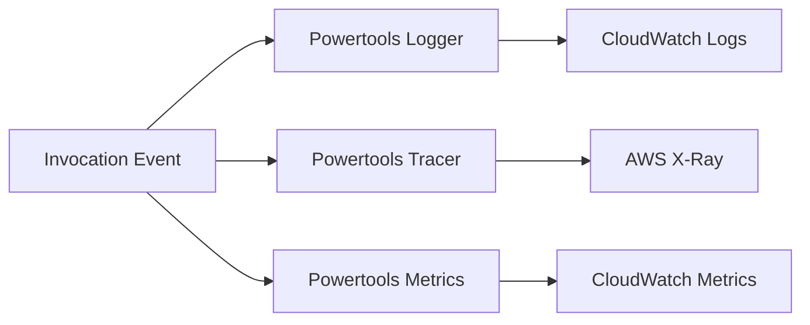

# Logging and Monitoring for Python Lambda

This tutorial adds structured logs, tracing, and metrics to a Python Lambda function using AWS Lambda Powertools for Python and AWS native observability services.
The goal is to make every invocation easier to debug without rewriting the application for each signal type.

## Prerequisites

- A deployed Python Lambda function.
- [Configure Python Lambda Functions](./03-configuration.md) completed.
- IAM permissions for CloudWatch Logs, CloudWatch metrics, and X-Ray tracing.
- Ability to add Python dependencies and redeploy the function.

## What You'll Build

You will build a function that emits:

- Structured JSON logs with correlation-friendly fields.
- Traces to AWS X-Ray.
- Application and custom business metrics in CloudWatch.
- Consistent error logging around Python exceptions.

## Steps

1. Add Powertools dependencies.

```text
aws-lambda-powertools==3.0.0
```

2. Instrument the handler.

```python
from aws_lambda_powertools import Logger, Metrics, Tracer
from aws_lambda_powertools.metrics import MetricUnit

logger = Logger(service="payments-api")
tracer = Tracer(service="payments-api")
metrics = Metrics(namespace="LambdaGuide", service="payments-api")


@tracer.capture_lambda_handler
@logger.inject_lambda_context(log_event=True)
@metrics.log_metrics(capture_cold_start_metric=True)
def handler(event, context):
    amount = event.get("amount", 0)
    logger.append_keys(function_name=context.function_name)
    logger.info("processing request", extra={"amount": amount})
    metrics.add_metric(name="ProcessedRequests", unit=MetricUnit.Count, value=1)
    return {"statusCode": 200, "body": "ok"}
```

3. Enable active tracing in SAM.

```yaml
Resources:
  ObservedFunction:
    Type: AWS::Serverless::Function
    Properties:
      CodeUri: .
      Handler: app.handler
      Runtime: python3.12
      Tracing: Active
      Policies:
        - AWSXrayWriteOnlyAccess
```

4. Deploy the updated function.

```bash
sam build && sam deploy
```

5. Invoke the function with test data.

```bash
aws lambda invoke   --function-name "$FUNCTION_NAME"   --cli-binary-format raw-in-base64-out   --payload '{"amount": 1250}'   "observability.json"
```

6. Tail logs to verify JSON output.

```bash
aws logs tail "/aws/lambda/$FUNCTION_NAME" --follow --region "$REGION"
```

Expected log pattern:

```json
{"level":"INFO","message":"processing request","service":"payments-api","amount":1250}
```



## Verification

Check all three observability outputs:

```bash
aws logs describe-log-groups --log-group-name-prefix "/aws/lambda/$FUNCTION_NAME" --region "$REGION"
aws cloudwatch list-metrics --namespace "LambdaGuide" --region "$REGION"
aws xray get-service-graph --start-time "2026-01-01T00:00:00Z" --end-time "2026-01-01T01:00:00Z" --region "$REGION"
```

Expected results:

- CloudWatch Logs contains structured JSON entries.
- CloudWatch metrics lists `ProcessedRequests` or the EMF-generated metric.
- X-Ray shows service graph data after invocations complete.

## See Also

- [Configure Python Lambda Functions](./03-configuration.md)
- [CI/CD for Python Lambda](./06-ci-cd.md)
- [Custom Metrics Recipe](./recipes/custom-metrics.md)
- [Python Runtime Reference](./python-runtime.md)

## Sources

- [AWS Lambda Powertools for Python](https://docs.aws.amazon.com/powertools/python/latest/)
- [Monitoring Lambda functions with CloudWatch](https://docs.aws.amazon.com/lambda/latest/dg/monitoring-functions.html)
- [Using AWS X-Ray with Lambda](https://docs.aws.amazon.com/lambda/latest/dg/services-xray.html)
- [Lambda function metrics](https://docs.aws.amazon.com/lambda/latest/dg/monitoring-metrics-types.html)
