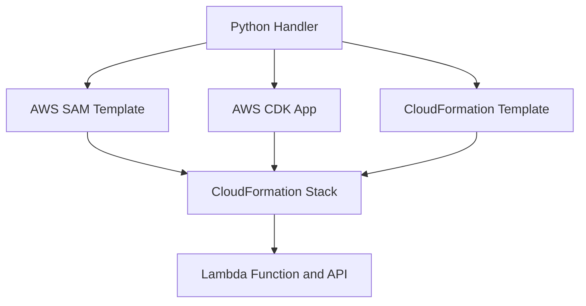

# Infrastructure as Code for Python Lambda

This tutorial compares the three most common infrastructure-as-code paths for Python Lambda workloads: AWS SAM, AWS CDK, and raw AWS CloudFormation.
Use it when you want to standardize packaging and deployment choices across teams.

## Prerequisites

- A working Python Lambda handler.
- Familiarity with CloudFormation stacks and IAM permissions.
- AWS SAM CLI for SAM examples.
- Node.js installed if you want to synthesize CDK apps locally.

## What You'll Build

You will build equivalent infrastructure definitions for:

- A Python Lambda function with a handler and runtime.
- An HTTP API event source.
- Deployment-ready artifacts in SAM, CDK, and CloudFormation forms.

## Steps

1. Define the function with AWS SAM.

```yaml
AWSTemplateFormatVersion: '2010-09-09'
Transform: AWS::Serverless-2016-10-31
Resources:
  SamPythonFunction:
    Type: AWS::Serverless::Function
    Properties:
      CodeUri: .
      Handler: app.handler
      Runtime: python3.12
      Timeout: 10
      Events:
        Api:
          Type: HttpApi
          Properties:
            Path: /items
            Method: GET
```

2. Define the same workload with AWS CDK.

```python
from aws_cdk import App, Stack
from aws_cdk import aws_lambda as _lambda
from aws_cdk import aws_apigatewayv2_alpha as apigwv2
from aws_cdk.aws_apigatewayv2_integrations_alpha import HttpLambdaIntegration
from constructs import Construct


class PythonApiStack(Stack):
    def __init__(self, scope: Construct, construct_id: str, **kwargs) -> None:
        super().__init__(scope, construct_id, **kwargs)
        fn = _lambda.Function(
            self,
            "PythonFunction",
            runtime=_lambda.Runtime.PYTHON_3_12,
            handler="app.handler",
            code=_lambda.Code.from_asset("."),
            timeout=None,
        )
        api = apigwv2.HttpApi(self, "HttpApi")
        api.add_routes(path="/items", methods=[apigwv2.HttpMethod.GET], integration=HttpLambdaIntegration("ItemsIntegration", fn))

app = App()
PythonApiStack(app, "PythonApiStack")
app.synth()
```

3. Define the function in raw CloudFormation.

```yaml
Resources:
  PythonFunction:
    Type: AWS::Lambda::Function
    Properties:
      FunctionName: python-iac-function
      Runtime: python3.12
      Handler: app.handler
      Role: arn:aws:iam::<account-id>:role/lambda-exec
      Code:
        S3Bucket: deployment-artifacts-bucket
        S3Key: python-function.zip
      Timeout: 10
      MemorySize: 256
```

4. Build and deploy the SAM application.

```bash
sam build && sam deploy
```

5. Synthesize the CDK app when you want the generated CloudFormation template.

```bash
cdk synth
```

6. Deploy a raw CloudFormation stack if your organization standardizes directly on stack templates.

```bash
aws cloudformation deploy   --template-file "template.yaml"   --stack-name "python-iac-function"   --capabilities CAPABILITY_IAM   --region "$REGION"
```



## Verification

Use a stack-level validation workflow:

```bash
sam validate
cdk synth
aws cloudformation validate-template --template-body file://template.yaml --region "$REGION"
```

Expected results:

- SAM validates the transformed template structure.
- CDK synthesizes without construct errors.
- CloudFormation validates the template body and required properties.

## See Also

- [Configure Python Lambda Functions](./03-configuration.md)
- [CI/CD for Python Lambda](./06-ci-cd.md)
- [Deploy Python Lambda as a Container Image](./recipes/docker-image.md)
- [Python Guide Index](./index.md)

## Sources

- [AWS SAM specification](https://docs.aws.amazon.com/serverless-application-model/latest/developerguide/sam-specification.html)
- [AWS CDK Developer Guide](https://docs.aws.amazon.com/cdk/v2/guide/home.html)
- [AWS::Lambda::Function resource](https://docs.aws.amazon.com/AWSCloudFormation/latest/UserGuide/aws-resource-lambda-function.html)
