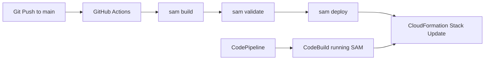

# CI/CD for Python Lambda

This tutorial creates a GitHub Actions workflow for build-and-deploy automation and maps it to an AWS CodePipeline alternative.
It is designed for teams that want repeatable, reviewable Lambda releases from source control.

## Prerequisites

- A SAM-based Python Lambda project.
- GitHub repository secrets for AWS authentication or OpenID Connect setup.
- Deployment stack names and region values chosen.
- Familiarity with [Infrastructure as Code for Python Lambda](./05-infrastructure-as-code.md).

## What You'll Build

You will build:

- A GitHub Actions workflow that installs Python, builds with SAM, and deploys with `sam deploy`.
- A deployment policy boundary using AWS credentials or GitHub OIDC.
- A CodePipeline alternative for organizations that prefer native AWS delivery tooling.

## Steps

1. Create a GitHub Actions workflow at `.github/workflows/python-lambda.yml`.

```yaml
name: deploy-python-lambda
on:
  push:
    branches: [main]
permissions:
  id-token: write
  contents: read
jobs:
  deploy:
    runs-on: ubuntu-latest
    steps:
      - name: Checkout
        uses: actions/checkout@v4
      - name: Set up Python
        uses: actions/setup-python@v5
        with:
          python-version: '3.12'
      - name: Set up SAM CLI
        uses: aws-actions/setup-sam@v2
      - name: Configure AWS credentials
        uses: aws-actions/configure-aws-credentials@v4
        with:
          aws-region: ap-northeast-2
          role-to-assume: arn:aws:iam::<account-id>:role/github-actions-deploy
      - name: Build
        run: sam build
      - name: Validate
        run: sam validate
      - name: Deploy
        run: sam deploy --no-confirm-changeset --no-fail-on-empty-changeset
```

2. Keep SAM deploy parameters in `samconfig.toml` so the workflow stays minimal.

```toml
version = 0.1
[default.deploy.parameters]
stack_name = "python-lambda-prod"
resolve_s3 = true
region = "ap-northeast-2"
capabilities = "CAPABILITY_IAM"
confirm_changeset = false
```

3. Add a branch protection rule so deployment only happens from reviewed changes.

4. Test the same workflow locally before relying on CI.

```bash
sam build
sam validate
sam deploy --no-confirm-changeset --no-fail-on-empty-changeset
```

5. Use CodePipeline when you want AWS-managed orchestration.

```text
Source stage -> Build stage (CodeBuild runs sam build and sam deploy) -> Deploy stage
```

6. Give the pipeline execution role permission to create and update CloudFormation stacks, Lambda functions, and related IAM roles.



## Verification

Verify your pipeline with both repository and AWS checks:

```bash
gh workflow list
aws cloudformation describe-stacks --stack-name "python-lambda-prod" --region "$REGION"
aws lambda get-function --function-name "$FUNCTION_NAME" --region "$REGION"
```

Expected results:

- The workflow appears in the repository and completes successfully.
- The CloudFormation stack reaches `UPDATE_COMPLETE` or `CREATE_COMPLETE`.
- The deployed Lambda function reflects the latest commit.

## See Also

- [Infrastructure as Code for Python Lambda](./05-infrastructure-as-code.md)
- [Deploy Your First Python Lambda Function](./02-first-deploy.md)
- [Logging and Monitoring for Python Lambda](./04-logging-monitoring.md)
- [Python Guide Index](./index.md)

## Sources

- [Deploying serverless applications using AWS SAM](https://docs.aws.amazon.com/serverless-application-model/latest/developerguide/deploying-serverless-applications.html)
- [Using GitHub Actions with AWS](https://docs.aws.amazon.com/prescriptive-guidance/latest/patterns/build-and-deploy-aws-lambda-functions-using-aws-cdk-and-github-actions.html)
- [What is AWS CodePipeline?](https://docs.aws.amazon.com/codepipeline/latest/userguide/welcome.html)
