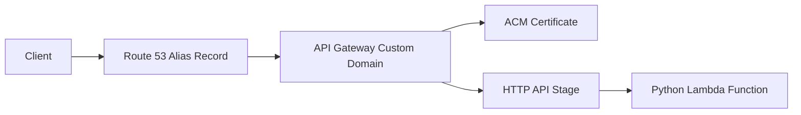

# Custom Domain and TLS for Python Lambda APIs

This tutorial connects a Python Lambda-backed API Gateway endpoint to a custom domain name secured with AWS Certificate Manager (ACM).
It uses a regional API endpoint so ACM, API Gateway, and Route 53 stay aligned.

## Prerequisites

- A deployed Lambda function integrated with API Gateway.
- Control of a Route 53 hosted zone for the target domain.
- An ACM certificate validated for your API hostname.
- Familiarity with `AWS::Serverless::HttpApi` or `AWS::ApiGatewayV2::DomainName` resources.

## What You'll Build

You will build:

- A regional custom domain such as `api.example.com`.
- ACM-backed TLS termination in API Gateway.
- A Route 53 alias record pointing clients to the custom domain target.

## Steps

1. Request or identify an ACM certificate in the same Region as your API.

```bash
aws acm request-certificate   --domain-name "api.example.com"   --validation-method DNS   --region "$REGION"
```

2. Define the custom domain in SAM.

```yaml
Resources:
  PythonHttpApi:
    Type: AWS::Serverless::HttpApi
    Properties:
      StageName: prod
      Domain:
        DomainName: api.example.com
        CertificateArn: arn:aws:acm:$REGION:<account-id>:certificate/xxxxxxxx-xxxx-xxxx-xxxx-xxxxxxxxxxxx
        Route53:
          HostedZoneName: example.com.
```

3. Attach the Lambda route to the API.

```yaml
  PythonApiFunction:
    Type: AWS::Serverless::Function
    Properties:
      CodeUri: .
      Handler: app.handler
      Runtime: python3.12
      Events:
        GetRoot:
          Type: HttpApi
          Properties:
            ApiId: !Ref PythonHttpApi
            Path: /
            Method: GET
```

4. Deploy the stack.

```bash
sam build && sam deploy
```

5. Validate that the custom domain and API mapping exist.

```bash
aws apigatewayv2 get-domain-name --domain-name "api.example.com" --region "$REGION"
aws apigatewayv2 get-api-mappings --domain-name "api.example.com" --region "$REGION"
```

6. Test the HTTPS endpoint after DNS propagates.

```bash
curl --verbose "https://api.example.com/"
```

Expected result:

- TLS negotiation succeeds.
- The Lambda-backed route returns the same payload as the default API Gateway URL.



## Verification

Confirm the full path from certificate to API mapping:

```bash
aws acm describe-certificate --certificate-arn "arn:aws:acm:$REGION:<account-id>:certificate/xxxxxxxx-xxxx-xxxx-xxxx-xxxxxxxxxxxx" --region "$REGION"
aws route53 list-resource-record-sets --hosted-zone-id "ZXXXXXXXXXXXXX"
curl --silent "https://api.example.com/"
```

Expected results:

- The certificate status is `ISSUED`.
- Route 53 contains the alias record for your API hostname.
- HTTPS requests succeed against the custom domain.

## See Also

- [Deploy Your First Python Lambda Function](./02-first-deploy.md)
- [Infrastructure as Code for Python Lambda](./05-infrastructure-as-code.md)
- [API Gateway HTTP API Recipe](./recipes/api-gateway-http.md)
- [Python Guide Index](./index.md)

## Sources

- [Custom domain names for HTTP APIs](https://docs.aws.amazon.com/apigateway/latest/developerguide/http-api-custom-domain-names.html)
- [AWS SAM HttpApi domain configuration](https://docs.aws.amazon.com/serverless-application-model/latest/developerguide/sam-property-httpapi-httpapidomainconfiguration.html)
- [Requesting public certificates with ACM](https://docs.aws.amazon.com/acm/latest/userguide/gs-acm-request-public.html)
- [Routing traffic to API Gateway with Route 53](https://docs.aws.amazon.com/Route53/latest/DeveloperGuide/routing-to-api-gateway.html)
