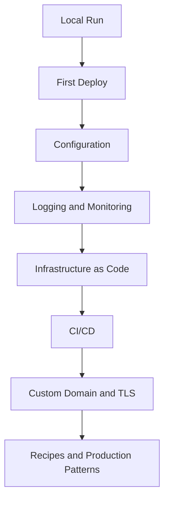

# Python on AWS Lambda

This language guide shows how to build, package, deploy, observe, and operate Python workloads on AWS Lambda.
It assumes a function-first workflow with AWS SAM for local development and repeatable infrastructure changes.

## Prerequisites

- Python 3.12 or later installed locally.
- AWS CLI configured with credentials for your target account.
- AWS SAM CLI installed.
- Docker installed for `sam local` workflows.
- A deployable IAM execution role ARN available as `$ROLE_ARN` if you use raw AWS CLI examples.

## What You'll Build

You will build a Python Lambda learning track that covers:

- Local invocation with `sam local invoke` and `sam local start-api`.
- First deployment with AWS SAM and AWS CLI validation commands.
- Function configuration for memory, timeout, layers, and VPC networking.
- Logging, tracing, metrics, and production-ready recipes for common event sources.

Recommended project layout:

```text
.
├── app.py
├── requirements.txt
├── template.yaml
└── events/
    └── event.json
```

## Learning Path

1. Start with [Run a Python Lambda Function Locally](./01-local-run.md) to validate the handler and event shape.
2. Continue to [Deploy Your First Python Lambda Function](./02-first-deploy.md) to publish the function and tail logs.
3. Use [Configure Python Lambda Functions](./03-configuration.md) and [Logging and Monitoring for Python Lambda](./04-logging-monitoring.md) to harden runtime behavior.
4. Adopt [Infrastructure as Code for Python Lambda](./05-infrastructure-as-code.md) and [CI/CD for Python Lambda](./06-ci-cd.md) for repeatable delivery.
5. Finish with recipes in [Python Recipes](./recipes/index.md) for event-driven integration patterns.

## Track Outcomes

By the end of this track, you should be able to:

- Package Python dependencies with `requirements.txt`.
- Choose between ZIP-based and container-image Lambda packaging.
- Build API, queue, stream, scheduler, and database integration patterns.
- Connect Lambda to API Gateway custom domains with ACM and Route 53.



## Suggested Pace

| Goal | Pages to Focus On | Output |
|---|---|---|
| First working function | `01-local-run.md`, `02-first-deploy.md` | One deployed Lambda and successful invoke |
| Production baseline | `03-configuration.md`, `04-logging-monitoring.md`, `python-runtime.md` | Observable, configurable function |
| Team delivery | `05-infrastructure-as-code.md`, `06-ci-cd.md` | Repeatable deploy pipeline |
| Integration patterns | `recipes/` pages | Event source implementations |

## Verification

Use this checklist before moving to the next page:

```bash
python3 --version
sam --version
aws --version
docker --version
aws sts get-caller-identity
```

Expected results:

- Local tooling is installed and available in your shell.
- `aws sts get-caller-identity` returns your caller without exposing secrets.
- You can build and test a Python Lambda package locally.

## See Also

- [Run a Python Lambda Function Locally](./01-local-run.md)
- [Python Runtime Reference](./python-runtime.md)
- [Python Recipes](./recipes/index.md)
- [Home](../../index.md)

## Sources

- [What is AWS Lambda?](https://docs.aws.amazon.com/lambda/latest/dg/welcome.html)
- [Lambda runtimes](https://docs.aws.amazon.com/lambda/latest/dg/lambda-runtimes.html)
- [AWS SAM developer guide](https://docs.aws.amazon.com/serverless-application-model/latest/developerguide/what-is-sam.html)
