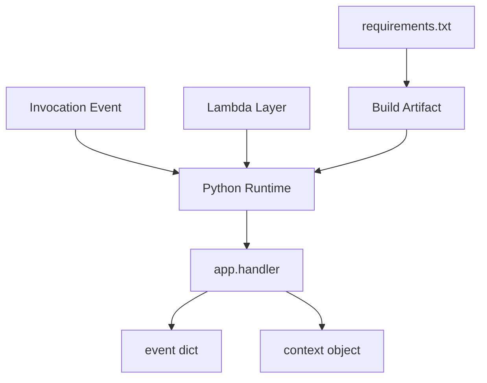

# Python Runtime Reference for AWS Lambda

This reference page summarizes the Python-specific runtime details that matter during packaging, handler design, dependency installation, and invocation behavior on AWS Lambda.
Use it alongside the tutorials when you need to confirm runtime contracts quickly.

## Prerequisites

- Basic familiarity with Python and Lambda deployment workflows.
- Access to the Lambda Developer Guide for current runtime availability checks.
- A project that already uses `app.py`, `requirements.txt`, or a SAM template.

## What You'll Build

You will build a mental model for:

- Python handler signatures and event parsing.
- The `context` object values exposed by Lambda.
- Supported Python runtime selection and dependency packaging.
- The relationship between deployment package contents and import behavior.

## Handler Signature

A Python Lambda handler receives `event` and `context`.

```python
def handler(event, context):
    return {
        "statusCode": 200,
        "body": "ok",
    }
```

Common expectations:

- `event` is a Python dictionary created from the triggering service payload.
- `context` is an object with invocation metadata.
- The handler string format is `file.function`, such as `app.handler`.

## Context Object

Typical fields used in Python code include:

```python
def handler(event, context):
    return {
        "request_id": context.aws_request_id,
        "function_name": context.function_name,
        "memory_limit_in_mb": context.memory_limit_in_mb,
        "remaining_ms": context.get_remaining_time_in_millis(),
    }
```

## Dependency Packaging

Use `requirements.txt` for ZIP-based deployments.

```text
boto3==1.34.0
requests==2.32.3
```

Install dependencies into the build artifact with SAM:

```bash
sam build
```

Or build a deployment directory manually:

```bash
python3 -m pip install --requirement "requirements.txt" --target "package"
cp "app.py" "package/app.py"
cd "package" && zip --recurse-paths "../function.zip" .
```

## Supported Runtime Selection

Use the current Lambda-supported Python runtime identifier in templates and CLI commands.
Examples from recent releases include `python3.13`, `python3.12`, and `python3.11`.
Always verify current support before creating long-lived infrastructure standards.

```yaml
Runtime: python3.12
Handler: app.handler
```

## Import Search Path Notes

Lambda loads code from the deployment package root first, then layers under `/opt/python` and related runtime-specific paths.
That means you should:

- Put your handler module at the archive root.
- Keep dependency versions consistent between your package and any attached layer.
- Avoid mixing duplicate libraries across the ZIP package and layers unless you control precedence intentionally.



## Recommended Runtime Practices

1. Pin dependencies in `requirements.txt`.
2. Initialize SDK clients outside the handler when reuse is safe.
3. Keep handler code thin and move business logic to testable modules.
4. Use layers only for clearly shared dependencies or tooling.
5. Match local build OS and architecture to the Lambda runtime when compiling native packages.

## Verification

Use these quick checks when runtime behavior looks suspicious:

```bash
aws lambda get-function-configuration --function-name "$FUNCTION_NAME" --region "$REGION"
aws lambda invoke --function-name "$FUNCTION_NAME" --cli-binary-format raw-in-base64-out --payload '{}' "runtime.json"
python3 -m json.tool "runtime.json"
```

Expected results:

- The configured `Runtime` matches the package you built.
- The handler string points to an existing Python module and function.
- Imports succeed during invocation without `Runtime.ImportModuleError`.

## See Also

- [Run a Python Lambda Function Locally](./01-local-run.md)
- [Configure Python Lambda Functions](./03-configuration.md)
- [Lambda Layers Recipe](./recipes/layers.md)
- [Python Guide Index](./index.md)

## Sources

- [Building Lambda functions with Python](https://docs.aws.amazon.com/lambda/latest/dg/lambda-python.html)
- [Lambda Python handler](https://docs.aws.amazon.com/lambda/latest/dg/python-handler.html)
- [Packaging Lambda functions as ZIP archives](https://docs.aws.amazon.com/lambda/latest/dg/python-package.html)
- [Lambda runtimes](https://docs.aws.amazon.com/lambda/latest/dg/lambda-runtimes.html)
