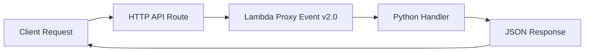

# Python Recipe: API Gateway HTTP API Trigger

This recipe uses API Gateway HTTP API version 2.0 events with a Python Lambda handler.
It is the preferred path when you want lower cost and simpler routing for Lambda-backed APIs.

## Prerequisites

- A Python Lambda project with SAM.
- Familiarity with [Run a Python Lambda Function Locally](../01-local-run.md).
- Permission to create Lambda and API Gateway v2 resources.

## What You'll Build

You will build:

- A Python handler that reads HTTP API v2 event fields.
- A SAM template with an `HttpApi` event source.
- A local and deployable route at `GET /health`.

## Steps

1. Create the handler.

```python
import json


def handler(event, context):
    body = {
        "version": event.get("version"),
        "rawPath": event.get("rawPath"),
        "method": event.get("requestContext", {}).get("http", {}).get("method"),
    }
    return {
        "statusCode": 200,
        "headers": {"Content-Type": "application/json"},
        "body": json.dumps(body),
    }
```

2. Add the SAM event definition.

```yaml
Resources:
  HttpApiFunction:
    Type: AWS::Serverless::Function
    Properties:
      CodeUri: .
      Handler: app.handler
      Runtime: python3.12
      Events:
        HealthRoute:
          Type: HttpApi
          Properties:
            Path: /health
            Method: GET
```

3. Create a sample HTTP API event.

```json
{
  "version": "2.0",
  "routeKey": "GET /health",
  "rawPath": "/health",
  "requestContext": {
    "http": {
      "method": "GET",
      "path": "/health"
    }
  }
}
```

4. Invoke locally.

```bash
sam build
sam local invoke "HttpApiFunction" --event "events/http-api.json"
```

Expected output:

```json
{"statusCode": 200, "headers": {"Content-Type": "application/json"}, "body": "{"version": "2.0", "rawPath": "/health", "method": "GET"}"}
```

5. Start the local API and test it.

```bash
sam local start-api
curl --silent "http://127.0.0.1:3000/health"
```



## Verification

```bash
sam validate
sam local invoke "HttpApiFunction" --event "events/http-api.json"
curl --silent "http://127.0.0.1:3000/health"
```

Expected results:

- The handler receives `version: 2.0`.
- Local HTTP requests reach the Lambda container successfully.
- Returned JSON includes the path and HTTP method.

## See Also

- [Python Recipes Index](./index.md)
- [API Gateway REST API Trigger](./api-gateway-rest.md)
- [Run a Python Lambda Function Locally](../01-local-run.md)
- [Custom Domain and TLS for Python Lambda APIs](../07-custom-domain-ssl.md)

## Sources

- [Create HTTP APIs in API Gateway](https://docs.aws.amazon.com/apigateway/latest/developerguide/http-api.html)
- [AWS SAM `HttpApi` event source](https://docs.aws.amazon.com/serverless-application-model/latest/developerguide/sam-property-function-httpapi.html)
