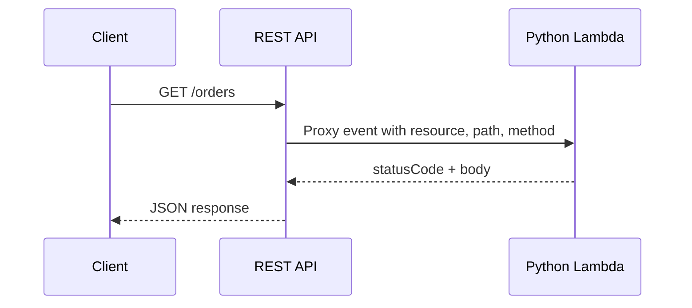

# Python Recipe: API Gateway REST API Trigger

This recipe wires a Python Lambda handler to API Gateway REST API using the classic proxy integration event shape.
Use it when you need REST API features such as usage plans, API keys, or stage variables.

## Prerequisites

- A Python Lambda project with SAM.
- Understanding of [Deploy Your First Python Lambda Function](../02-first-deploy.md).
- Permission to create API Gateway, Lambda, and IAM resources.

## What You'll Build

You will build:

- A Python handler that reads REST API proxy events.
- A SAM function with an `Api` event.
- A simple GET endpoint that returns method and path metadata.

## Steps

1. Create the handler in `app.py`.

```python
import json


def handler(event, context):
    body = {
        "resource": event.get("resource"),
        "path": event.get("path"),
        "httpMethod": event.get("httpMethod"),
    }
    return {
        "statusCode": 200,
        "headers": {"Content-Type": "application/json"},
        "body": json.dumps(body),
    }
```

2. Add the REST API event in `template.yaml`.

```yaml
Resources:
  RestApiFunction:
    Type: AWS::Serverless::Function
    Properties:
      CodeUri: .
      Handler: app.handler
      Runtime: python3.12
      Events:
        RestApi:
          Type: Api
          Properties:
            Path: /orders
            Method: GET
```

3. Create a sample REST API event.

```json
{
  "resource": "/orders",
  "path": "/orders",
  "httpMethod": "GET",
  "headers": {
    "Host": "example.execute-api.ap-northeast-2.amazonaws.com"
  }
}
```

4. Build and test the function locally.

```bash
sam build
sam local invoke "RestApiFunction" --event "events/rest-api.json"
```

Expected output:

```json
{"statusCode": 200, "headers": {"Content-Type": "application/json"}, "body": "{"resource": "/orders", "path": "/orders", "httpMethod": "GET"}"}
```

5. Start the REST API emulator and send a request.

```bash
sam local start-api
curl --silent "http://127.0.0.1:3000/orders"
```



## Verification

```bash
sam validate
sam local invoke "RestApiFunction" --event "events/rest-api.json"
curl --silent "http://127.0.0.1:3000/orders"
```

Expected results:

- Local invoke returns a proxy-integration response.
- The API emulator returns JSON for `GET /orders`.
- The handler reads classic REST API fields such as `resource` and `httpMethod`.

## See Also

- [Python Recipes Index](./index.md)
- [API Gateway HTTP API Trigger](./api-gateway-http.md)
- [Run a Python Lambda Function Locally](../01-local-run.md)
- [Custom Domain and TLS for Python Lambda APIs](../07-custom-domain-ssl.md)

## Sources

- [Set up Lambda proxy integrations in API Gateway](https://docs.aws.amazon.com/apigateway/latest/developerguide/set-up-lambda-proxy-integrations.html)
- [AWS SAM `Api` event source](https://docs.aws.amazon.com/serverless-application-model/latest/developerguide/sam-property-function-api.html)
