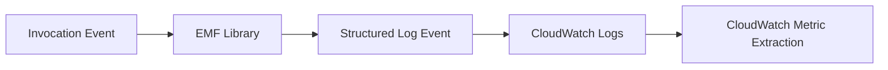

# Python Recipe: Publish Custom CloudWatch Metrics with EMF

This recipe emits custom business metrics from a Python Lambda function using the Embedded Metric Format (EMF).
Use it when built-in invocation metrics are not enough to describe your application outcomes.

## Prerequisites

- A Python Lambda function with CloudWatch Logs access.
- Familiarity with [Logging and Monitoring for Python Lambda](../04-logging-monitoring.md).
- An application metric you want to track, such as orders processed or payment failures.

## What You'll Build

You will build:

- A Python handler that emits EMF-compatible metrics.
- A SAM deployment that packages the metrics library.
- A test invoke command and expected metric output.

## Steps

1. Add the dependency.

```text
aws-embedded-metrics==3.2.0
```

2. Create the handler.

```python
from aws_embedded_metrics import metric_scope


@metric_scope
def handler(event, context, metrics):
    count = event.get("processed", 1)
    metrics.set_namespace("LambdaGuide")
    metrics.put_dimensions({"Service": "Orders"})
    metrics.put_metric("OrdersProcessed", count, "Count")
    return {"processed": count}
```

3. Add a standard Lambda function definition in SAM.

```yaml
Resources:
  MetricsFunction:
    Type: AWS::Serverless::Function
    Properties:
      CodeUri: .
      Handler: app.handler
      Runtime: python3.12
```

4. Invoke the function.

```bash
sam build
aws lambda invoke   --function-name "$FUNCTION_NAME"   --cli-binary-format raw-in-base64-out   --payload '{"processed":3}'   "metrics-response.json"
```

Expected output:

```json
{"processed": 3}
```

5. List the metric after invocations arrive in CloudWatch.

```bash
aws cloudwatch list-metrics --namespace "LambdaGuide" --region "$REGION"
```



## Verification

```bash
sam validate
aws lambda invoke --function-name "$FUNCTION_NAME" --cli-binary-format raw-in-base64-out --payload '{"processed":3}' "metrics-response.json"
aws cloudwatch list-metrics --namespace "LambdaGuide" --region "$REGION"
```

Expected results:

- The function returns the processed count.
- CloudWatch Logs receives EMF-formatted log events.
- CloudWatch Metrics lists `OrdersProcessed` in the `LambdaGuide` namespace.

## See Also

- [Python Recipes Index](./index.md)
- [Logging and Monitoring for Python Lambda](../04-logging-monitoring.md)
- [Amazon EventBridge Rule Trigger](./eventbridge-rule.md)
- [Python Runtime Reference](../python-runtime.md)

## Sources

- [Embedding metrics within logs with EMF](https://docs.aws.amazon.com/AmazonCloudWatch/latest/monitoring/CloudWatch_Embedded_Metric_Format.html)
- [Monitor Lambda functions with CloudWatch](https://docs.aws.amazon.com/lambda/latest/dg/monitoring-functions.html)
