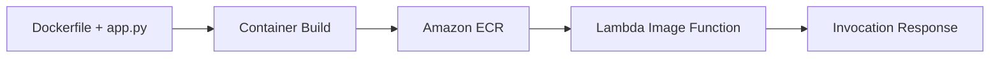

# Python Recipe: Deploy Lambda as a Container Image

This recipe packages a Python Lambda function as a container image and deploys it from Amazon ECR.
Use it when you need custom OS libraries, larger dependencies, or an image-centric delivery workflow.

## Prerequisites

- Docker installed locally.
- Amazon ECR repository access.
- Familiarity with [Infrastructure as Code for Python Lambda](../05-infrastructure-as-code.md).

## What You'll Build

You will build:

- A Python Lambda container image based on the AWS Lambda Python base image.
- An ECR image push workflow.
- A SAM template that uses `PackageType: Image`.

## Steps

1. Create a Dockerfile.

```dockerfile
FROM public.ecr.aws/lambda/python:3.12
COPY app.py ${LAMBDA_TASK_ROOT}
COPY requirements.txt ${LAMBDA_TASK_ROOT}
RUN python -m pip install --requirement requirements.txt --target ${LAMBDA_TASK_ROOT}
CMD ["app.handler"]
```

2. Create the handler.

```python
def handler(event, context):
    return {"message": "container image lambda"}
```

3. Build and tag the image.

```bash
docker build --tag "$ACCOUNT_ID.dkr.ecr.$REGION.amazonaws.com/python-image-lambda:latest" .
```

4. Push the image to Amazon ECR.

```bash
aws ecr get-login-password --region "$REGION" | docker login --username AWS --password-stdin "$ACCOUNT_ID.dkr.ecr.$REGION.amazonaws.com"
docker push "$ACCOUNT_ID.dkr.ecr.$REGION.amazonaws.com/python-image-lambda:latest"
```

5. Reference the image in SAM.

```yaml
Resources:
  ImageFunction:
    Type: AWS::Serverless::Function
    Properties:
      PackageType: Image
      ImageUri: <account-id>.dkr.ecr.$REGION.amazonaws.com/python-image-lambda:latest
```

6. Invoke the function after deployment.

```bash
aws lambda invoke --function-name "$FUNCTION_NAME" --cli-binary-format raw-in-base64-out --payload '{}' "image-response.json"
```

Expected output:

```json
{"message": "container image lambda"}
```



## Verification

```bash
docker images
aws ecr describe-repositories --repository-names "python-image-lambda" --region "$REGION"
aws lambda invoke --function-name "$FUNCTION_NAME" --cli-binary-format raw-in-base64-out --payload '{}' "image-response.json"
```

Expected results:

- The image is built locally and pushed to ECR.
- Lambda references the image URI from your account and Region.
- The deployed container-image function invokes successfully.

## See Also

- [Python Recipes Index](./index.md)
- [Infrastructure as Code for Python Lambda](../05-infrastructure-as-code.md)
- [Lambda Layers for Shared Dependencies](./layers.md)
- [Python Runtime Reference](../python-runtime.md)

## Sources

- [Deploy Python Lambda functions with container images](https://docs.aws.amazon.com/lambda/latest/dg/python-image.html)
- [Create a Lambda function using a container image](https://docs.aws.amazon.com/lambda/latest/dg/images-create.html)
