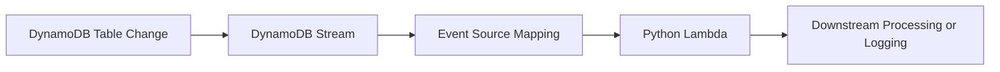

# Python Recipe: DynamoDB Streams Event Processing

This recipe processes DynamoDB Streams records with a Python Lambda function.
Use it for change-data-capture workloads such as projections, search indexing, and downstream notifications.

## Prerequisites

- A DynamoDB table with streams enabled.
- A Python Lambda project with IAM permission to read the stream through an event source mapping.
- Familiarity with [Configure Python Lambda Functions](../03-configuration.md).

## What You'll Build

You will build:

- A handler that loops through `Records` from DynamoDB Streams.
- A SAM event source mapping from a table stream ARN.
- A test event and expected processing summary.

## Steps

1. Create the handler.

```python
def handler(event, context):
    processed = []
    for record in event["Records"]:
        processed.append({
            "eventName": record["eventName"],
            "keys": record["dynamodb"]["Keys"],
        })
    return {"processed": processed}
```

2. Add the stream trigger in `template.yaml`.

```yaml
Resources:
  StreamProcessor:
    Type: AWS::Serverless::Function
    Properties:
      CodeUri: .
      Handler: app.handler
      Runtime: python3.12
      Events:
        OrdersStream:
          Type: DynamoDB
          Properties:
            Stream: arn:aws:dynamodb:$REGION:<account-id>:table/orders/stream/2026-01-01T00:00:00.000
            StartingPosition: LATEST
            BatchSize: 100
```

3. Create a sample stream event.

```json
{
  "Records": [
    {
      "eventID": "1",
      "eventName": "INSERT",
      "dynamodb": {
        "Keys": {
          "order_id": {"S": "1001"}
        }
      }
    }
  ]
}
```

4. Invoke locally.

```bash
sam build
sam local invoke "StreamProcessor" --event "events/dynamodb-stream.json"
```

Expected output:

```json
{"processed": [{"eventName": "INSERT", "keys": {"order_id": {"S": "1001"}}}]}
```

5. Deploy when the local event output looks correct.

```bash
sam deploy
```



## Verification

```bash
sam validate
sam local invoke "StreamProcessor" --event "events/dynamodb-stream.json"
aws lambda list-event-source-mappings --function-name "$FUNCTION_NAME" --region "$REGION"
```

Expected results:

- The local event is parsed into one or more stream records.
- The deployed function has an event source mapping for the stream ARN.
- Changes in the DynamoDB table generate Lambda invocations.

## See Also

- [Python Recipes Index](./index.md)
- [EventBridge Rule Trigger](./eventbridge-rule.md)
- [Configure Python Lambda Functions](../03-configuration.md)
- [Logging and Monitoring for Python Lambda](../04-logging-monitoring.md)

## Sources

- [Using Lambda with DynamoDB](https://docs.aws.amazon.com/lambda/latest/dg/with-ddb.html)
- [AWS SAM `DynamoDB` event source](https://docs.aws.amazon.com/serverless-application-model/latest/developerguide/sam-property-function-dynamodb.html)
