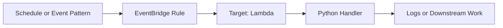

# Python Recipe: Amazon EventBridge Rule Trigger

This recipe invokes a Python Lambda function from an EventBridge schedule or event pattern.
Use it for cron-like jobs, service event routing, and application event buses.

## Prerequisites

- A Python Lambda deployment path.
- Permission to create EventBridge rules and targets.
- Familiarity with event-driven invocation patterns.

## What You'll Build

You will build:

- A handler that inspects EventBridge event metadata.
- A scheduled rule or event-pattern rule in SAM.
- A local event payload for testing before deployment.

## Steps

1. Create the handler.

```python
def handler(event, context):
    return {
        "source": event.get("source"),
        "detail_type": event.get("detail-type"),
        "detail": event.get("detail", {}),
    }
```

2. Add the EventBridge rule.

```yaml
Resources:
  EventBridgeFunction:
    Type: AWS::Serverless::Function
    Properties:
      CodeUri: .
      Handler: app.handler
      Runtime: python3.12
      Events:
        NightlySchedule:
          Type: Schedule
          Properties:
            Schedule: cron(0 15 * * ? *)
            Name: nightly-python-job
```

3. Create a sample event-pattern payload.

```json
{
  "version": "0",
  "id": "abcd-1234",
  "detail-type": "OrderCreated",
  "source": "com.example.orders",
  "detail": {
    "order_id": "1001"
  }
}
```

4. Invoke locally.

```bash
sam build
sam local invoke "EventBridgeFunction" --event "events/eventbridge.json"
```

Expected output:

```json
{"source": "com.example.orders", "detail_type": "OrderCreated", "detail": {"order_id": "1001"}}
```

5. Put a test event into the default bus after deployment.

```bash
aws events put-events   --entries '[{"Source":"com.example.orders","DetailType":"OrderCreated","Detail":"{""order_id"":""1001""}"}]'   --region "$REGION"
```



## Verification

```bash
sam validate
sam local invoke "EventBridgeFunction" --event "events/eventbridge.json"
aws events list-rule-names-by-target --target-arn "$FUNCTION_ARN" --region "$REGION"
```

Expected results:

- The local invoke returns event metadata fields.
- EventBridge lists the Lambda target rule.
- Scheduled or matched events result in Lambda invocations.

## See Also

- [Python Recipes Index](./index.md)
- [Step Functions Integration](./step-functions.md)
- [Amazon SNS Topic Subscription](./sns-trigger.md)
- [Logging and Monitoring for Python Lambda](../04-logging-monitoring.md)

## Sources

- [Using Lambda with Amazon EventBridge](https://docs.aws.amazon.com/lambda/latest/dg/services-cloudwatchevents.html)
- [AWS SAM `Schedule` event source](https://docs.aws.amazon.com/serverless-application-model/latest/developerguide/sam-property-function-schedule.html)
