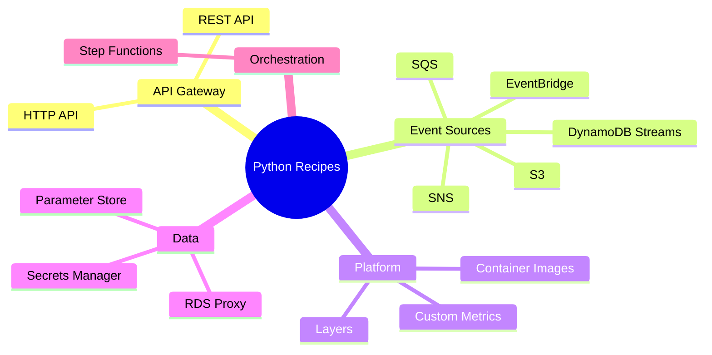

# Python Lambda Recipes

This catalog groups Python Lambda integration recipes by the AWS service that triggers the function or the operational capability you want to add.
Use it after you complete the core Python tutorials so you can copy a pattern that already matches your event source.

## Prerequisites

- Completion of the Python track basics in [Run a Python Lambda Function Locally](../01-local-run.md) and [Deploy Your First Python Lambda Function](../02-first-deploy.md).
- A Python runtime selected in [Python Runtime Reference](../python-runtime.md).
- AWS SAM or equivalent deployment tooling available.

## What You'll Build

You will build a recipe toolbox for:

- API-driven Lambda functions with REST API and HTTP API integrations.
- Event-driven functions for S3, SNS, SQS, DynamoDB Streams, and EventBridge.
- Configuration and platform integrations such as layers, Parameters, Secrets, RDS Proxy, custom metrics, Step Functions, and container images.

## Recipe Catalog

| Category | Recipes | Primary Outcome |
|---|---|---|
| API | `api-gateway-rest.md`, `api-gateway-http.md` | Synchronous request/response Lambda APIs |
| Event sources | `dynamodb-streams.md`, `s3-event.md`, `sqs-trigger.md`, `sns-trigger.md`, `eventbridge-rule.md` | Native AWS event processing |
| Orchestration | `step-functions.md` | Workflow task integration |
| Configuration data | `secrets-manager.md`, `parameter-store.md` | Runtime config retrieval |
| Shared components | `layers.md`, `docker-image.md` | Packaging and dependency reuse |
| Observability | `custom-metrics.md` | Business metrics and EMF |
| Data access | `rds-proxy.md` | Database access with pooled connections |



## How to Use a Recipe

1. Start with the handler code.
2. Add the matching SAM template snippet.
3. Create or review the sample event payload.
4. Invoke the function locally or remotely.
5. Verify the expected output and then adapt names, ARNs, and policies.

## Verification

Use the same baseline checks regardless of recipe type:

```bash
sam validate
sam build
aws lambda list-functions --region "$REGION"
```

Expected results:

- Your SAM template remains valid after adding a recipe.
- The build step includes Python dependencies successfully.
- You can identify the target function in the chosen Region.

## See Also

- [Python Guide Index](../index.md)
- [Python Runtime Reference](../python-runtime.md)
- [Configure Python Lambda Functions](../03-configuration.md)
- [Logging and Monitoring for Python Lambda](../04-logging-monitoring.md)

## Sources

- [Using Lambda with other services](https://docs.aws.amazon.com/lambda/latest/dg/lambda-services.html)
- [Event source mappings](https://docs.aws.amazon.com/lambda/latest/dg/invocation-eventsourcemapping.html)
- [AWS SAM developer guide](https://docs.aws.amazon.com/serverless-application-model/latest/developerguide/what-is-sam.html)
