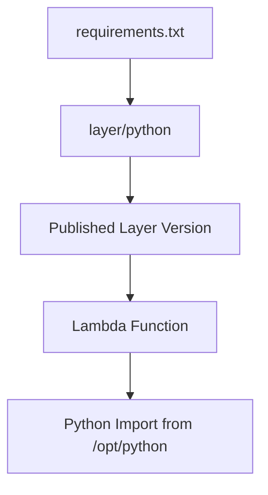

# Python Recipe: Lambda Layers for Shared Dependencies

This recipe packages shared Python dependencies into a Lambda layer and attaches the published layer version to a function.
Use it when several functions need the same libraries or helper modules.

## Prerequisites

- A Python dependency set that is reused across functions.
- ZIP-based Lambda packaging rather than container image packaging.
- Permission to publish layer versions.

## What You'll Build

You will build:

- A `python/` folder that contains shared dependencies.
- A published layer version referenced by `$LAYER_ARN`.
- A function that imports a dependency from the layer.

## Steps

1. Install dependencies into the layer folder.

```bash
mkdir --parents "layer/python"
python3 -m pip install --requirement "requirements.txt" --target "layer/python"
```

2. Publish the layer version.

```bash
zip --recurse-paths "python-layer.zip" "layer"
aws lambda publish-layer-version   --layer-name "python-shared-deps"   --zip-file "fileb://python-layer.zip"   --compatible-runtimes "python3.12"   --region "$REGION"
```

3. Create a handler that imports from the layer.

```python
import requests


def handler(event, context):
    return {"requests_version": requests.__version__}
```

4. Reference the layer in SAM.

```yaml
Resources:
  LayeredFunction:
    Type: AWS::Serverless::Function
    Properties:
      CodeUri: .
      Handler: app.handler
      Runtime: python3.12
      Layers:
        - $LAYER_ARN
```

5. Invoke the function after deployment.

```bash
aws lambda invoke --function-name "$FUNCTION_NAME" --cli-binary-format raw-in-base64-out --payload '{}' "layer-response.json"
```

Expected output:

```json
{"requests_version": "2.32.3"}
```



## Verification

```bash
aws lambda list-layer-versions --layer-name "python-shared-deps" --region "$REGION"
aws lambda get-function-configuration --function-name "$FUNCTION_NAME" --region "$REGION"
aws lambda invoke --function-name "$FUNCTION_NAME" --cli-binary-format raw-in-base64-out --payload '{}' "layer-response.json"
```

Expected results:

- A layer version exists for the chosen runtime.
- The function configuration includes the layer ARN.
- Imports succeed at runtime without packaging the dependency inside the function ZIP.

## See Also

- [Python Recipes Index](./index.md)
- [Python Runtime Reference](../python-runtime.md)
- [Configure Python Lambda Functions](../03-configuration.md)
- [Deploy Python Lambda as a Container Image](./docker-image.md)

## Sources

- [Creating and sharing Lambda layers](https://docs.aws.amazon.com/lambda/latest/dg/chapter-layers.html)
- [Adding layers to functions](https://docs.aws.amazon.com/lambda/latest/dg/adding-layers.html)
