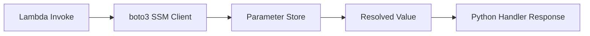

# Python Recipe: AWS Systems Manager Parameter Store

This recipe retrieves configuration values from AWS Systems Manager Parameter Store inside a Python Lambda function.
Use it for non-secret configuration, hierarchies, and environment-specific settings.

## Prerequisites

- A parameter created in Parameter Store.
- IAM permission for `ssm:GetParameter`.
- A Python Lambda function that can make AWS SDK calls.

## What You'll Build

You will build:

- A Python handler that reads a named parameter.
- A SAM template with SSM read permissions.
- A test event and expected output.

## Steps

1. Create the handler.

```python
import boto3

ssm = boto3.client("ssm")


def handler(event, context):
    name = event.get("name", "/app/config/log-level")
    response = ssm.get_parameter(Name=name, WithDecryption=False)
    return {"name": name, "value": response["Parameter"]["Value"]}
```

2. Add IAM permissions.

```yaml
Resources:
  ParameterFunction:
    Type: AWS::Serverless::Function
    Properties:
      CodeUri: .
      Handler: app.handler
      Runtime: python3.12
      Policies:
        - Statement:
            - Effect: Allow
              Action:
                - ssm:GetParameter
              Resource: arn:aws:ssm:$REGION:<account-id>:parameter/app/config/*
```

3. Create a sample event.

```json
{
  "name": "/app/config/log-level"
}
```

4. Invoke locally.

```bash
sam build
sam local invoke "ParameterFunction" --event "events/parameter.json"
```

Expected output:

```json
{"name": "/app/config/log-level", "value": "INFO"}
```

5. Seed the parameter in AWS if needed.

```bash
aws ssm put-parameter --name "/app/config/log-level" --value "INFO" --type "String" --overwrite --region "$REGION"
```



## Verification

```bash
sam validate
sam local invoke "ParameterFunction" --event "events/parameter.json"
aws ssm get-parameter --name "/app/config/log-level" --region "$REGION"
```

Expected results:

- The handler can resolve the parameter name to a string value.
- The parameter exists in the expected Region.
- The execution role has read access to the parameter path.

## See Also

- [Python Recipes Index](./index.md)
- [AWS Secrets Manager with Caching](./secrets-manager.md)
- [Configure Python Lambda Functions](../03-configuration.md)
- [Python Runtime Reference](../python-runtime.md)

## Sources

- [Use Systems Manager Parameter Store parameters in Lambda functions](https://docs.aws.amazon.com/lambda/latest/dg/configuration-envvars.html#configuration-envvars-secrets)
- [GetParameter API](https://docs.aws.amazon.com/systems-manager/latest/APIReference/API_GetParameter.html)
