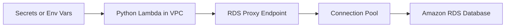

# Python Recipe: Amazon RDS Proxy Integration

This recipe connects a Python Lambda function to a relational database through Amazon RDS Proxy.
Use it when Lambda concurrency would otherwise create too many direct database connections.

## Prerequisites

- An Amazon RDS or Aurora database with an RDS Proxy endpoint.
- Lambda VPC configuration for the same subnets and security groups used by the proxy.
- A secret or other credential source for the database user.

## What You'll Build

You will build:

- A Python handler that opens a database connection through the proxy endpoint.
- A SAM template with VPC settings and environment variables.
- A local contract test and an invoke command for the deployed function.

## Steps

1. Add dependencies.

```text
PyMySQL==1.1.1
```

2. Create the handler.

```python
import os
import pymysql


def handler(event, context):
    connection = pymysql.connect(
        host=os.environ["DB_PROXY_ENDPOINT"],
        user=os.environ["DB_USER"],
        password=os.environ["DB_PASSWORD"],
        database=os.environ["DB_NAME"],
        connect_timeout=5,
    )
    with connection.cursor() as cursor:
        cursor.execute("SELECT 1")
        result = cursor.fetchone()
    connection.close()
    return {"result": result[0]}
```

3. Add function configuration.

```yaml
Resources:
  RdsProxyFunction:
    Type: AWS::Serverless::Function
    Properties:
      CodeUri: .
      Handler: app.handler
      Runtime: python3.12
      Timeout: 15
      VpcConfig:
        SecurityGroupIds:
          - sg-xxxxxxxxxxxxxxxxx
        SubnetIds:
          - subnet-xxxxxxxx
          - subnet-yyyyyyyy
      Environment:
        Variables:
          DB_PROXY_ENDPOINT: myproxy.proxy-abcdefghijkl.ap-northeast-2.rds.amazonaws.com
          DB_USER: appuser
          DB_PASSWORD: <db-password>
          DB_NAME: appdb
```

4. Test the contract locally with a mocked response event.

```bash
sam build
sam local invoke "RdsProxyFunction" --event "events/rds-proxy.json"
```

Sample event:

```json
{}
```

Expected output after a successful deployed invoke:

```json
{"result": 1}
```

5. Invoke the deployed function.

```bash
aws lambda invoke --function-name "$FUNCTION_NAME" --cli-binary-format raw-in-base64-out --payload '{}' "rds-proxy.json"
```



## Verification

```bash
aws rds describe-db-proxies --region "$REGION"
aws lambda get-function-configuration --function-name "$FUNCTION_NAME" --region "$REGION"
aws lambda invoke --function-name "$FUNCTION_NAME" --cli-binary-format raw-in-base64-out --payload '{}' "rds-proxy.json"
```

Expected results:

- The function is attached to the required VPC subnets and security groups.
- The RDS Proxy endpoint exists and is available.
- The deployed function returns a successful database probe.

## See Also

- [Python Recipes Index](./index.md)
- [AWS Secrets Manager with Caching](./secrets-manager.md)
- [Configure Python Lambda Functions](../03-configuration.md)
- [Python Runtime Reference](../python-runtime.md)

## Sources

- [Using Lambda with Amazon RDS Proxy](https://docs.aws.amazon.com/lambda/latest/dg/services-rds.html)
- [Configuring Lambda functions to access resources in a VPC](https://docs.aws.amazon.com/lambda/latest/dg/configuration-vpc.html)
