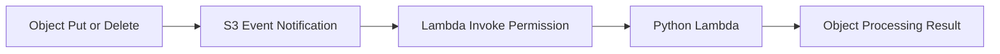

# Python Recipe: Amazon S3 Event Notifications

This recipe triggers a Python Lambda function from Amazon S3 object create and delete notifications.
Use it for thumbnailing, indexing, metadata extraction, or cleanup workflows.

## Prerequisites

- An S3 bucket in the same account or a planned cross-account permissions model.
- Lambda execution role permission to read the bucket object if needed.
- A SAM-managed function or equivalent deployment path.

## What You'll Build

You will build:

- A handler that iterates S3 event records.
- A SAM function attached to an S3 bucket notification.
- A local test event for object-created notifications.

## Steps

1. Create the handler.

```python
def handler(event, context):
    results = []
    for record in event["Records"]:
        results.append({
            "bucket": record["s3"]["bucket"]["name"],
            "key": record["s3"]["object"]["key"],
            "event": record["eventName"],
        })
    return {"records": results}
```

2. Add the S3 trigger in SAM.

```yaml
Resources:
  UploadBucket:
    Type: AWS::S3::Bucket
  S3EventFunction:
    Type: AWS::Serverless::Function
    Properties:
      CodeUri: .
      Handler: app.handler
      Runtime: python3.12
      Policies:
        - S3ReadPolicy:
            BucketName: !Ref UploadBucket
      Events:
        ObjectCreated:
          Type: S3
          Properties:
            Bucket: !Ref UploadBucket
            Events:
              - s3:ObjectCreated:*
```

3. Create a sample event.

```json
{
  "Records": [
    {
      "eventName": "ObjectCreated:Put",
      "s3": {
        "bucket": {"name": "uploads-bucket"},
        "object": {"key": "invoices/january.csv"}
      }
    }
  ]
}
```

4. Invoke locally.

```bash
sam build
sam local invoke "S3EventFunction" --event "events/s3-object-created.json"
```

Expected output:

```json
{"records": [{"bucket": "uploads-bucket", "key": "invoices/january.csv", "event": "ObjectCreated:Put"}]}
```

5. Upload a test object after deployment.

```bash
aws s3 cp "sample.csv" "s3://uploads-bucket/invoices/january.csv" --region "$REGION"
```



## Verification

```bash
sam validate
sam local invoke "S3EventFunction" --event "events/s3-object-created.json"
aws s3api get-bucket-notification-configuration --bucket "uploads-bucket"
```

Expected results:

- Local invoke returns bucket and key metadata.
- The bucket has a Lambda notification configuration.
- Real object uploads create Lambda invocations and logs.

## See Also

- [Python Recipes Index](./index.md)
- [Layers Recipe](./layers.md)
- [Deploy Your First Python Lambda Function](../02-first-deploy.md)
- [Logging and Monitoring for Python Lambda](../04-logging-monitoring.md)

## Sources

- [Using Lambda with Amazon S3](https://docs.aws.amazon.com/lambda/latest/dg/with-s3.html)
- [AWS SAM `S3` event source](https://docs.aws.amazon.com/serverless-application-model/latest/developerguide/sam-property-function-s3.html)
