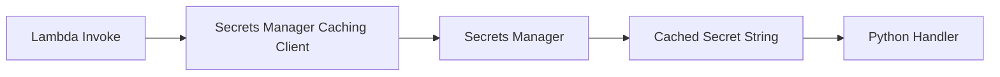

# Python Recipe: AWS Secrets Manager with Caching

This recipe reads application secrets from AWS Secrets Manager and caches them in-process to reduce repeated API calls.
Use it when you need rotated credentials or sensitive configuration data at runtime.

## Prerequisites

- A secret already stored in AWS Secrets Manager.
- IAM permission for `secretsmanager:GetSecretValue`.
- Python dependencies packaged with the function.

## What You'll Build

You will build:

- A Python handler that retrieves a secret through the caching client.
- A SAM template with the required IAM policy.
- A local test event and expected output shape.

## Steps

1. Add dependencies.

```text
aws-secretsmanager-caching==1.1.2
boto3==1.34.0
```

2. Create the handler.

```python
import json
import boto3
from aws_secretsmanager_caching import SecretCache, SecretCacheConfig

client = boto3.client("secretsmanager")
cache = SecretCache(config=SecretCacheConfig(), client=client)


def handler(event, context):
    secret_id = event.get("secret_id", "app/db")
    secret_string = cache.get_secret_string(secret_id)
    secret = json.loads(secret_string)
    return {"username": secret["username"]}
```

3. Add the policy in SAM.

```yaml
Resources:
  SecretsFunction:
    Type: AWS::Serverless::Function
    Properties:
      CodeUri: .
      Handler: app.handler
      Runtime: python3.12
      Policies:
        - Statement:
            - Effect: Allow
              Action:
                - secretsmanager:GetSecretValue
              Resource: arn:aws:secretsmanager:$REGION:<account-id>:secret:app/db-*
```

4. Invoke the handler with a sample event.

```bash
sam build
sam local invoke "SecretsFunction" --event "events/secrets.json"
```

Sample `events/secrets.json`:

```json
{
  "secret_id": "app/db"
}
```

Expected output:

```json
{"username": "appuser"}
```

5. Validate the secret in AWS.

```bash
aws secretsmanager get-secret-value --secret-id "app/db" --region "$REGION"
```



## Verification

```bash
sam validate
sam local invoke "SecretsFunction" --event "events/secrets.json"
aws secretsmanager describe-secret --secret-id "app/db" --region "$REGION"
```

Expected results:

- The handler returns non-sensitive derived data instead of the full secret.
- The secret exists and is readable by the execution role.
- Repeated invocations can reuse the cache in a warm execution environment.

## See Also

- [Python Recipes Index](./index.md)
- [SSM Parameter Store](./parameter-store.md)
- [Configure Python Lambda Functions](../03-configuration.md)
- [RDS Proxy Integration](./rds-proxy.md)

## Sources

- [Use Secrets Manager secrets in Lambda functions](https://docs.aws.amazon.com/lambda/latest/dg/with-secrets-manager.html)
- [GetSecretValue API](https://docs.aws.amazon.com/secretsmanager/latest/apireference/API_GetSecretValue.html)
