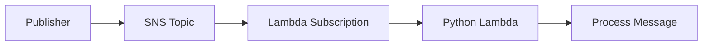

# Python Recipe: Amazon SNS Topic Subscription

This recipe subscribes a Python Lambda function to an Amazon SNS topic.
Use it for fan-out patterns where one published message should trigger multiple downstream consumers.

## Prerequisites

- An SNS topic or permission to create one.
- A Python Lambda function deployment path.
- IAM permissions for Lambda invoke permissions on the topic.

## What You'll Build

You will build:

- A handler that processes SNS message envelopes.
- A SAM template that creates a topic subscription.
- A local test event and a publish command.

## Steps

1. Create the handler.

```python
def handler(event, context):
    messages = []
    for record in event["Records"]:
        messages.append(record["Sns"]["Message"])
    return {"messages": messages}
```

2. Add the SNS trigger.

```yaml
Resources:
  NotificationsTopic:
    Type: AWS::SNS::Topic
  SnsConsumer:
    Type: AWS::Serverless::Function
    Properties:
      CodeUri: .
      Handler: app.handler
      Runtime: python3.12
      Events:
        TopicEvent:
          Type: SNS
          Properties:
            Topic: !Ref NotificationsTopic
```

3. Create a sample event.

```json
{
  "Records": [
    {
      "Sns": {
        "Message": "invoice-created"
      }
    }
  ]
}
```

4. Invoke locally.

```bash
sam build
sam local invoke "SnsConsumer" --event "events/sns.json"
```

Expected output:

```json
{"messages": ["invoice-created"]}
```

5. Publish a test message after deployment.

```bash
aws sns publish --topic-arn "$TOPIC_ARN" --message "invoice-created" --region "$REGION"
```



## Verification

```bash
sam validate
sam local invoke "SnsConsumer" --event "events/sns.json"
aws sns list-subscriptions-by-topic --topic-arn "$TOPIC_ARN" --region "$REGION"
```

Expected results:

- The local invoke returns the SNS message body.
- The topic lists the Lambda subscription.
- Published SNS messages trigger the function and produce log entries.

## See Also

- [Python Recipes Index](./index.md)
- [Amazon SQS Queue Trigger](./sqs-trigger.md)
- [Logging and Monitoring for Python Lambda](../04-logging-monitoring.md)
- [Deploy Your First Python Lambda Function](../02-first-deploy.md)

## Sources

- [Using Lambda with Amazon SNS](https://docs.aws.amazon.com/lambda/latest/dg/with-sns.html)
- [AWS SAM `SNS` event source](https://docs.aws.amazon.com/serverless-application-model/latest/developerguide/sam-property-function-sns.html)
