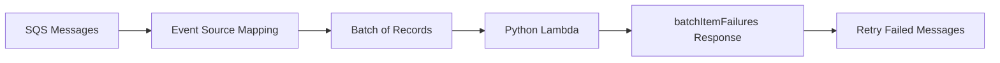

# Python Recipe: Amazon SQS Queue Trigger

This recipe uses an Amazon SQS queue as a Lambda event source with batch processing and partial batch failure support.
Use it when you want asynchronous retry behavior and controlled throughput.

## Prerequisites

- An SQS queue or permission to create one.
- A Python Lambda project with IAM permission to consume from SQS.
- Familiarity with Lambda event source mappings.

## What You'll Build

You will build:

- A handler that processes SQS records in a batch.
- A SAM event source mapping with partial batch response support.
- A sample queue event and test invocation.

## Steps

1. Create the handler.

```python
def handler(event, context):
    failures = []
    for record in event["Records"]:
        body = record["body"]
        if "fail" in body:
            failures.append({"itemIdentifier": record["messageId"]})
    return {"batchItemFailures": failures}
```

2. Add the SQS trigger.

```yaml
Resources:
  OrdersQueue:
    Type: AWS::SQS::Queue
  SqsConsumer:
    Type: AWS::Serverless::Function
    Properties:
      CodeUri: .
      Handler: app.handler
      Runtime: python3.12
      Events:
        QueueEvent:
          Type: SQS
          Properties:
            Queue: !GetAtt OrdersQueue.Arn
            BatchSize: 10
            FunctionResponseTypes:
              - ReportBatchItemFailures
```

3. Create a sample event.

```json
{
  "Records": [
    {"messageId": "msg-1", "body": "ok"},
    {"messageId": "msg-2", "body": "fail-this-message"}
  ]
}
```

4. Invoke locally.

```bash
sam build
sam local invoke "SqsConsumer" --event "events/sqs.json"
```

Expected output:

```json
{"batchItemFailures": [{"itemIdentifier": "msg-2"}]}
```

5. Send a real test message after deployment.

```bash
aws sqs send-message --queue-url "$QUEUE_URL" --message-body "ok" --region "$REGION"
```



## Verification

```bash
sam validate
sam local invoke "SqsConsumer" --event "events/sqs.json"
aws lambda list-event-source-mappings --function-name "$FUNCTION_NAME" --region "$REGION"
```

Expected results:

- The local output includes failed message identifiers when needed.
- The Lambda function has an SQS event source mapping.
- Failed messages remain eligible for retry according to queue settings.

## See Also

- [Python Recipes Index](./index.md)
- [SNS Topic Trigger](./sns-trigger.md)
- [EventBridge Rule Trigger](./eventbridge-rule.md)
- [Configure Python Lambda Functions](../03-configuration.md)

## Sources

- [Using Lambda with Amazon SQS](https://docs.aws.amazon.com/lambda/latest/dg/with-sqs.html)
- [Reporting batch item failures for Lambda with SQS](https://docs.aws.amazon.com/lambda/latest/dg/with-sqs.html#events-sqs-batchfailurereporting)
- [AWS SAM `SQS` event source](https://docs.aws.amazon.com/serverless-application-model/latest/developerguide/sam-property-function-sqs.html)
