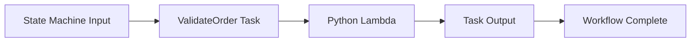

# Python Recipe: AWS Step Functions Integration

This recipe connects a Python Lambda function to an AWS Step Functions state machine task.
Use it when your Lambda function is one step in a multi-step workflow with retries, branching, and service integrations.

## Prerequisites

- A Python Lambda function and IAM permissions for Step Functions.
- Familiarity with event payload contracts between workflow states and Lambda.
- AWS SAM or CloudFormation deployment tooling.

## What You'll Build

You will build:

- A Python task handler that reads workflow input.
- A state machine that invokes the Lambda function.
- A sample execution input and expected task output.

## Steps

1. Create the handler.

```python
def handler(event, context):
    order_id = event["order_id"]
    return {
        "order_id": order_id,
        "status": "validated",
    }
```

2. Add the Lambda function and state machine in SAM.

```yaml
Resources:
  WorkflowFunction:
    Type: AWS::Serverless::Function
    Properties:
      CodeUri: .
      Handler: app.handler
      Runtime: python3.12
  OrderWorkflow:
    Type: AWS::Serverless::StateMachine
    Properties:
      Definition:
        StartAt: ValidateOrder
        States:
          ValidateOrder:
            Type: Task
            Resource: !GetAtt WorkflowFunction.Arn
            End: true
```

3. Create a sample task input.

```json
{
  "order_id": "1001"
}
```

4. Invoke locally for the Lambda task contract.

```bash
sam build
sam local invoke "WorkflowFunction" --event "events/step-functions.json"
```

Expected output:

```json
{"order_id": "1001", "status": "validated"}
```

5. Start a real workflow execution after deployment.

```bash
aws stepfunctions start-execution   --state-machine-arn "$STATE_MACHINE_ARN"   --input '{"order_id":"1001"}'   --region "$REGION"
```



## Verification

```bash
sam validate
sam local invoke "WorkflowFunction" --event "events/step-functions.json"
aws stepfunctions describe-state-machine --state-machine-arn "$STATE_MACHINE_ARN" --region "$REGION"
```

Expected results:

- Local invoke matches the task input and output contract.
- The state machine definition references the Lambda task.
- Started executions reach `SUCCEEDED` when the handler returns normally.

## See Also

- [Python Recipes Index](./index.md)
- [EventBridge Rule Trigger](./eventbridge-rule.md)
- [CI/CD for Python Lambda](../06-ci-cd.md)
- [Infrastructure as Code for Python Lambda](../05-infrastructure-as-code.md)

## Sources

- [Using Lambda with AWS Step Functions](https://docs.aws.amazon.com/lambda/latest/dg/with-step-functions.html)
- [AWS SAM state machine resources](https://docs.aws.amazon.com/serverless-application-model/latest/developerguide/sam-resource-statemachine.html)
