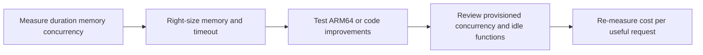

# Lambda Cost Optimization

Cost optimization on Lambda is mostly about matching memory, execution time, concurrency, and architecture choices to the real workload.

## When to Use

- Use when monthly Lambda cost is rising faster than request volume.
- Use when functions are consistently overprovisioned on memory or provisioned concurrency.
- Use when duration is high enough that CPU scaling from more memory might reduce total cost.

## Optimization Loop



## Memory-Duration Tradeoff

Lambda allocates CPU proportionally with memory.

That means raising memory can reduce execution duration enough to lower total compute cost for CPU-bound workloads.

Operational rule:

- Do not assume the cheapest memory setting is the lowest-cost setting.
- Benchmark several memory values with representative traffic.

## AWS Lambda Power Tuning

AWS Lambda Power Tuning helps compare duration and cost across memory sizes.

Use it when:

- The workload has meaningful compute time.
- You need evidence before changing memory in production.
- A function is both slow and expensive.

Run tuning in a controlled test environment and promote the chosen setting through infrastructure as code.

## ARM64 (Graviton2)

ARM64 can reduce Lambda pricing and sometimes improve price-performance.

Use it when:

- Your runtime and dependencies support ARM64.
- Native packages are available or can be rebuilt for ARM64.
- You want lower compute cost without changing the handler logic.

Validate:

- Layer compatibility
- Native extension compatibility
- Container base image compatibility if you use image packaging

## Provisioned vs On-Demand Cost

| Mode | Cost pattern | Best fit |
|---|---|---|
| On-demand only | No standing concurrency allocation cost | Irregular traffic and async jobs |
| Provisioned concurrency | Additional baseline cost plus execution cost | User-facing low-latency APIs |

Choose provisioned concurrency only when latency benefits justify always-on cost.

## Unused Function Cleanup

Review functions that are:

- No longer referenced by event sources
- Replaced by newer stacks or aliases
- Retained from experiments or migrations

```bash
aws lambda list-functions \
    --region "$REGION"

aws lambda list-event-source-mappings \
    --function-name "$FUNCTION_NAME" \
    --region "$REGION"
```

Delete obsolete functions only after confirming they are not part of a rollback path.

## Right-Sizing Checklist

Tune these together rather than in isolation:

| Setting | Too low | Too high |
|---|---|---|
| Memory | Longer duration, timeout risk | Wasted compute spend |
| Timeout | Premature failures | Slow error detection and retries |
| Ephemeral storage | Runtime failure for temp-heavy jobs | Unneeded allocation |
| Provisioned concurrency | Cold-start spillover | Idle standing cost |

## Practical Actions

```bash
aws lambda update-function-configuration \
    --function-name "$FUNCTION_NAME" \
    --memory-size 1024 \
    --timeout 30 \
    --architectures arm64 \
    --region "$REGION"
```

After changing memory or architecture, publish a new version and compare:

- Average and p95 duration
- Error rate
- Cost trend over a representative period

## Verification

- Confirm duration improved or cost decreased for the target workload shape.
- Confirm no compatibility issue appears after moving to ARM64.
- Confirm provisioned concurrency utilization remains high enough to justify cost.
- Confirm unused functions and stale versions are retired safely.

## See Also

- [Provisioned Concurrency](./provisioned-concurrency.md)
- [Monitoring](./monitoring.md)
- [Service Limits](../reference/service-limits.md)
- [Performance](../best-practices/performance.md)

## Sources

- https://docs.aws.amazon.com/lambda/latest/dg/configuration-memory.html
- https://docs.aws.amazon.com/lambda/latest/dg/foundation-arch.html
- https://docs.aws.amazon.com/lambda/latest/dg/provisioned-concurrency.html
- https://docs.aws.amazon.com/lambda/latest/dg/gettingstarted-limits.html
- https://docs.aws.amazon.com/lambda/latest/dg/configuration-ephemeral-storage.html
