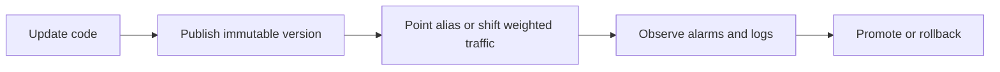

# Lambda Deployment Strategies

Use deployment strategies to control blast radius when releasing new Lambda code or configuration.

Production Lambda releases should usually move traffic through a versioned alias rather than sending requests directly to `$LATEST`.

## When to Use

- Use all-at-once for low-risk internal workloads where rollback is simple.
- Use blue/green with aliases when you want instant cutover and instant rollback.
- Use canary or linear traffic shifting when a change could affect latency, authorization, schema handling, or downstream load.
- Use AWS SAM deployment preferences when you want repeatable traffic shifting in infrastructure as code.

## Release Patterns

| Strategy | How traffic moves | Best fit | Main tradeoff |
|---|---|---|---|
| All-at-once | Alias moves 100% at once | Small, low-risk functions | Largest immediate blast radius |
| Blue/green | Alias flips from old version to new version | Fast rollback operations | Requires good pre-cutover validation |
| Canary | Small percentage first, then full rollout | Higher-risk production changes | More monitoring coordination |
| Linear | Traffic increases in steps | Moderate-risk, sustained observation | Longer rollout window |

## Release Flow



## All-at-Once Alias Cutover

Publish a new version and move the alias immediately.

```bash
aws lambda publish-version \
    --function-name "$FUNCTION_NAME" \
    --description "Release 2026-04-07" \
    --region "$REGION"

aws lambda update-alias \
    --function-name "$FUNCTION_NAME" \
    --name "$ALIAS_NAME" \
    --function-version 12 \
    --region "$REGION"
```

Use this when the function is stateless, downstream impact is low, and rollback is well rehearsed.

## Blue/Green with Aliases

Treat the current alias target as blue and the candidate version as green.

1. Publish the new version.
2. Validate with pre-production tests or a separate validation alias.
3. Repoint the production alias to the new version.
4. Roll back by restoring the prior version number.

```bash
aws lambda get-alias \
    --function-name "$FUNCTION_NAME" \
    --name "$ALIAS_NAME" \
    --region "$REGION"

aws lambda update-alias \
    --function-name "$FUNCTION_NAME" \
    --name "$ALIAS_NAME" \
    --function-version 12 \
    --description "Blue green promotion" \
    --region "$REGION"
```

## Canary with Weighted Alias Routing

Weighted routing sends a small percentage to the new version while the alias still points to the stable version.

```bash
aws lambda update-alias \
    --function-name "$FUNCTION_NAME" \
    --name "$ALIAS_NAME" \
    --function-version 11 \
    --routing-config AdditionalVersionWeights={12=0.05} \
    --region "$REGION"
```

Watch these metrics during the canary window:

- `Errors`
- `Duration`
- `Throttles`
- `ConcurrentExecutions`
- API Gateway `5XXError` or caller-side retry rate if applicable

If the canary is healthy, complete the rollout:

```bash
aws lambda update-alias \
    --function-name "$FUNCTION_NAME" \
    --name "$ALIAS_NAME" \
    --function-version 12 \
    --region "$REGION"
```

## Linear Shifts with CodeDeploy

AWS CodeDeploy can shift Lambda alias traffic gradually and stop deployments when CloudWatch alarms enter alarm state.

Typical linear sequence:

- 10 percent every 1 minute
- 10 percent every 10 minutes
- 25 percent every 5 minutes

Use linear shifts when you need more than one observation point before full promotion.

## SAM AutoPublishAlias and DeploymentPreference

AWS SAM can publish versions automatically and manage alias traffic shifting declaratively.

```yaml
Transform: AWS::Serverless-2024-10-16
Resources:
  ApiFunction:
    Type: AWS::Serverless::Function
    Properties:
      CodeUri: .
      Handler: app.handler
      Runtime: python3.12
      AutoPublishAlias: live
      DeploymentPreference:
        Type: Canary10Percent5Minutes
        Alarms:
          - !Ref FunctionErrorsAlarm
```

Use SAM when you want:

- Immutable version publishing on each deployment.
- Built-in traffic shifting presets.
- Rollback driven by CloudWatch alarms.

## Practical Guardrails

- Never run production traffic from `$LATEST`.
- Do not shift traffic without alarm coverage.
- Coordinate database or event schema changes so both old and new versions can run safely during overlap.
- Keep the previous stable version available until the rollout window closes.

## Verification

- Confirm `list-versions-by-function` shows the expected new version.
- Confirm `get-alias` reflects the intended target version or routing config.
- Confirm alarms remain OK during canary or linear rollout.
- Confirm rollback command is documented and tested.

## Rollback / Troubleshooting

- If error rate rises, update the alias back to the prior version immediately.
- If CodeDeploy stops a deployment, review the triggered alarm and function logs before retrying.
- If clients report inconsistent behavior, verify both versions are compatible with the current event shape and downstream contract.
- If routing config remains after promotion, clear weighted routing and repoint the alias to the stable version only.

## See Also

- [Versioning and Aliases](./versioning-and-aliases.md)
- [Monitoring](./monitoring.md)
- [Deployment Best Practices](../best-practices/deployment.md)
- [Reliability](../best-practices/reliability.md)

## Sources

- https://docs.aws.amazon.com/lambda/latest/dg/configuration-versions.html
- https://docs.aws.amazon.com/lambda/latest/dg/configuration-aliases.html
- https://docs.aws.amazon.com/lambda/latest/dg/configuring-alias-routing.html
- https://docs.aws.amazon.com/serverless-application-model/latest/developerguide/sam-property-function-deploymentpreference.html
- https://docs.aws.amazon.com/codedeploy/latest/userguide/deployment-steps-lambda.html
