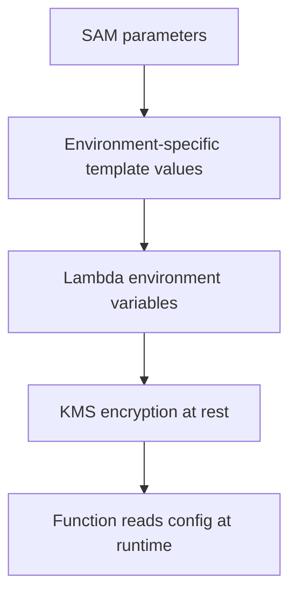

# Lambda Environment Management

Environment management keeps stage-specific configuration out of code and makes releases reproducible across development, staging, and production.

## When to Use

- Use when the same function code runs in multiple stages.
- Use when secrets or endpoints differ by environment.
- Use when teams need consistent deployment-time parameterization through AWS SAM.

## Configuration Model



## Environment Variables

Use environment variables for non-secret configuration such as:

- Table names
- Log level
- Feature flags
- Downstream endpoint names

```bash
aws lambda update-function-configuration \
    --function-name "$FUNCTION_NAME" \
    --environment 'Variables={APP_ENV=prod,LOG_LEVEL=INFO,POWERTOOLS_SERVICE_NAME=orders-api}' \
    --region "$REGION"
```

Keep the total environment variable payload within Lambda service limits.

## Encrypted Environment Variables with KMS

Lambda encrypts environment variables at rest. You can use a customer managed KMS key for more control.

```bash
aws lambda update-function-configuration \
    --function-name "$FUNCTION_NAME" \
    --kms-key-arn "arn:aws:kms:$REGION:<account-id>:key/12345678-1234-1234-1234-123456789012" \
    --region "$REGION"
```

Use a customer managed KMS key when you need:

- Explicit key rotation policy
- Tighter audit boundaries
- Controlled key access review

## SAM Parameter Overrides

Use parameters for stage-specific values in templates.

```yaml
Transform: AWS::Serverless-2024-10-16
Parameters:
  AppEnv:
    Type: String
  LogLevel:
    Type: String
Resources:
  ApiFunction:
    Type: AWS::Serverless::Function
    Properties:
      CodeUri: .
      Handler: app.handler
      Runtime: python3.12
      Environment:
        Variables:
          APP_ENV: !Ref AppEnv
          LOG_LEVEL: !Ref LogLevel
```

Deploy with stage overrides:

```bash
sam deploy \
    --stack-name "$FUNCTION_NAME-prod" \
    --parameter-overrides AppEnv=prod LogLevel=INFO \
    --region "$REGION" \
    --capabilities CAPABILITY_IAM
```

## Per-Stage Configuration Strategy

Recommended split:

| Config type | Store in | Example |
|---|---|---|
| Non-secret runtime setting | Environment variable | `APP_ENV=prod` |
| Secret value | Secrets Manager or Parameter Store SecureString | database credential |
| Deploy-time stage choice | SAM parameter | subnet IDs, log level |
| Cross-resource metadata | Tags | owner, cost center |

## Tagging Strategy

Apply consistent tags to functions and stacks.

Suggested baseline tags:

- `Environment=prod`
- `Application=orders-api`
- `Owner=platform-team`
- `CostCenter=serverless`
- `DataClassification=internal`

```bash
aws lambda tag-resource \
    --resource "arn:aws:lambda:$REGION:<account-id>:function:$FUNCTION_NAME" \
    --tags Environment=prod Application=orders-api Owner=platform-team \
    --region "$REGION"
```

## Operational Guardrails

- Do not store plaintext secrets in source control.
- Do not hard-code stage-specific URLs or ARNs in handlers.
- Keep environment naming consistent across all languages and functions.
- Treat configuration changes like releases because they can change behavior without code changes.

## Verification

```bash
aws lambda get-function-configuration \
    --function-name "$FUNCTION_NAME" \
    --region "$REGION"

aws lambda list-tags \
    --resource "arn:aws:lambda:$REGION:<account-id>:function:$FUNCTION_NAME" \
    --region "$REGION"
```

Confirm:

- Expected stage variables are present.
- KMS key assignment matches policy.
- Required tags exist for governance and cost analysis.

## See Also

- [Security Operations](./security-operations.md)
- [Versioning and Aliases](./versioning-and-aliases.md)
- [Environment Variables Reference](../reference/environment-variables.md)
- [Security](../best-practices/security.md)

## Sources

- https://docs.aws.amazon.com/lambda/latest/dg/configuration-envvars.html
- https://docs.aws.amazon.com/lambda/latest/dg/configuration-envvars-encryption.html
- https://docs.aws.amazon.com/serverless-application-model/latest/developerguide/sam-cli-command-reference-sam-deploy.html
- https://docs.aws.amazon.com/lambda/latest/dg/configuration-tags.html
