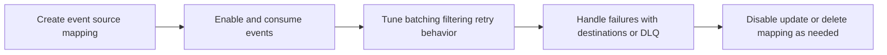

# Lambda Event Source Management

Event source management covers how Lambda consumes records from queues and streams, how retries behave, and how to tune event source mappings for stable throughput.

## When to Use

- Use when integrating Lambda with SQS, Kinesis, DynamoDB Streams, or Amazon MQ.
- Use when consumer lag, duplicate processing, or poison-pill records affect operations.
- Use when you need to tune batch size, batching window, filtering, or failure destinations.

## Event Source Lifecycle



## Event Source Mapping Lifecycle

Create and inspect mappings explicitly.

```bash
aws lambda create-event-source-mapping \
    --function-name "$FUNCTION_NAME" \
    --event-source-arn "arn:aws:sqs:$REGION:<account-id>:orders-queue" \
    --batch-size 10 \
    --enabled \
    --region "$REGION"

aws lambda list-event-source-mappings \
    --function-name "$FUNCTION_NAME" \
    --region "$REGION"
```

Update operational settings as workload characteristics change.

```bash
aws lambda update-event-source-mapping \
    --uuid "a1b2c3d4-1111-2222-3333-444455556666" \
    --batch-size 50 \
    --maximum-batching-window-in-seconds 5 \
    --region "$REGION"
```

## Batch Window Tuning

Batch window controls how long Lambda waits to accumulate more records before invoking the function.

Use a larger window when:

- Throughput is low and you want better batching efficiency.
- Slight latency increase is acceptable.

Use a smaller window when:

- End-to-end latency matters more than batching efficiency.
- Backlog grows during peak traffic.

## Partial Batch Response

Partial batch response lets the function report only failed records for supported event sources so successfully processed records are not retried unnecessarily.

Use it when:

- Individual bad records should not replay an entire successful batch.
- Retry volume from poison-pill messages is too high.

This is especially valuable for SQS and stream-based processing with idempotent record handling.

## DLQ vs On-Failure Destination

These are not interchangeable.

| Mechanism | Typical use | Notes |
|---|---|---|
| Dead-letter queue | Store failed asynchronous invocations or source-side failed records where supported | Good for later inspection or replay |
| On-failure destination | Send failure record to another target with invocation context | Richer routing and processing options |

Choose based on whether you need simple retention or structured post-failure workflows.

## Filtering

Event filtering reduces invocations by discarding records that do not match filter criteria before they reach the handler.

Use it when:

- Only a subset of events is relevant.
- You want to reduce unnecessary invocation cost.
- You need one source stream to feed multiple focused consumers.

## Practical Operational Checks

- Monitor `IteratorAge` for Kinesis and DynamoDB Streams.
- Watch queue depth and Lambda concurrency together for SQS.
- Confirm retry behavior matches idempotency guarantees.
- Document how poison-pill records are isolated and replayed.

## Verification

```bash
aws lambda get-event-source-mapping \
    --uuid "a1b2c3d4-1111-2222-3333-444455556666" \
    --region "$REGION"
```

Confirm:

- Mapping state is `Enabled` or expected maintenance state.
- Batch size and window match the workload plan.
- Filtering criteria and failure targets are configured correctly.
- Consumer lag remains within acceptable bounds.

## See Also

- [Monitoring](./monitoring.md)
- [Cost Optimization](./cost-optimization.md)
- [Event Sources](../platform/event-sources.md)
- [Reliability](../best-practices/reliability.md)

## Sources

- https://docs.aws.amazon.com/lambda/latest/dg/invocation-eventsourcemapping.html
- https://docs.aws.amazon.com/lambda/latest/dg/services-sqs-configure.html
- https://docs.aws.amazon.com/lambda/latest/dg/services-kinesis-parameters.html
- https://docs.aws.amazon.com/lambda/latest/dg/services-ddb-params.html
- https://docs.aws.amazon.com/lambda/latest/dg/invocation-async-retain-records.html
- https://docs.aws.amazon.com/lambda/latest/dg/invocation-eventfiltering.html
